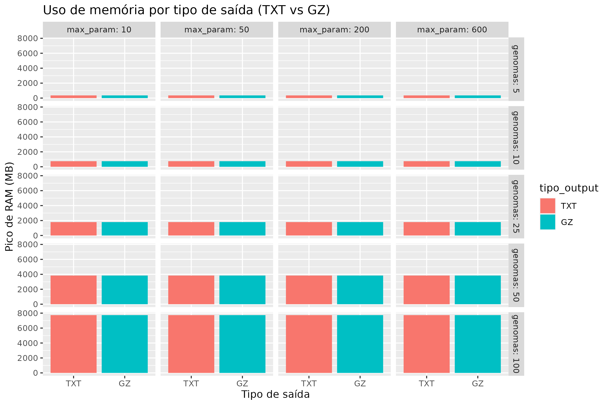
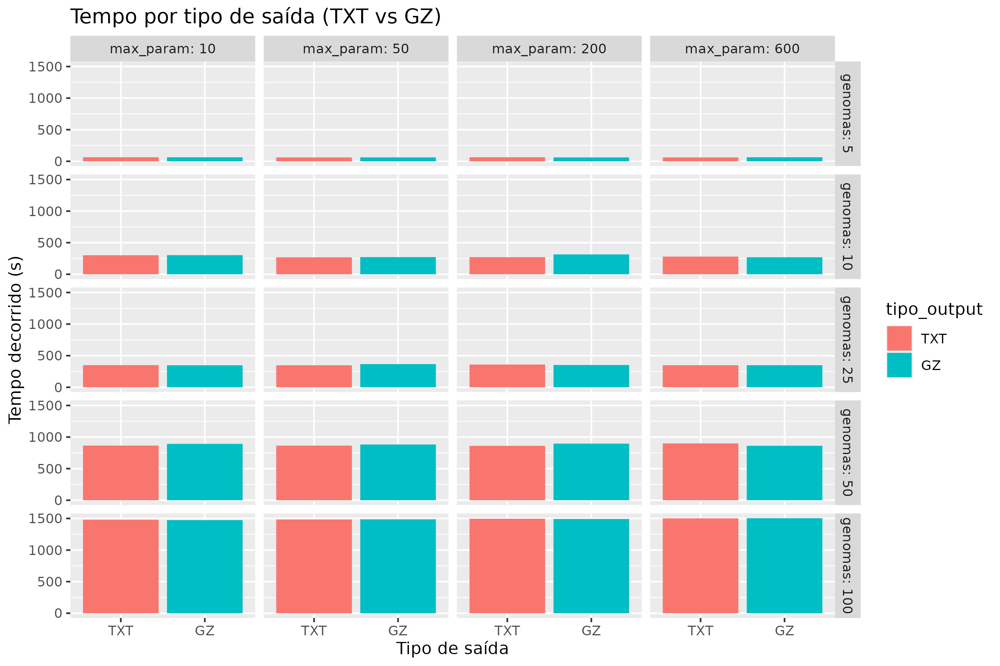
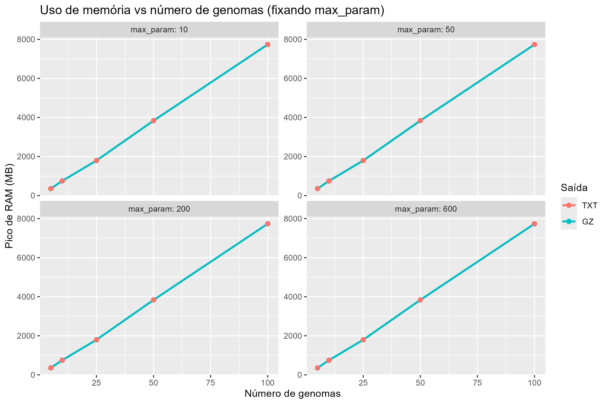
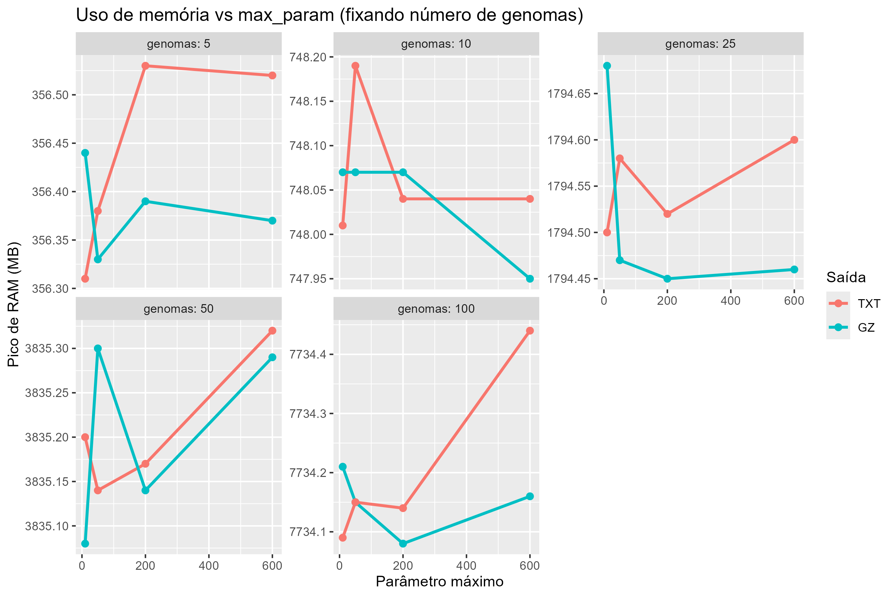
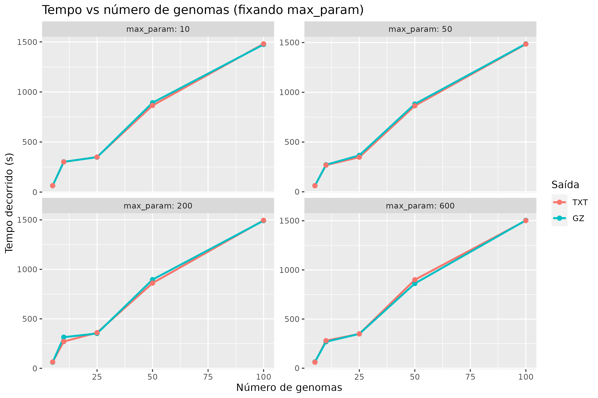
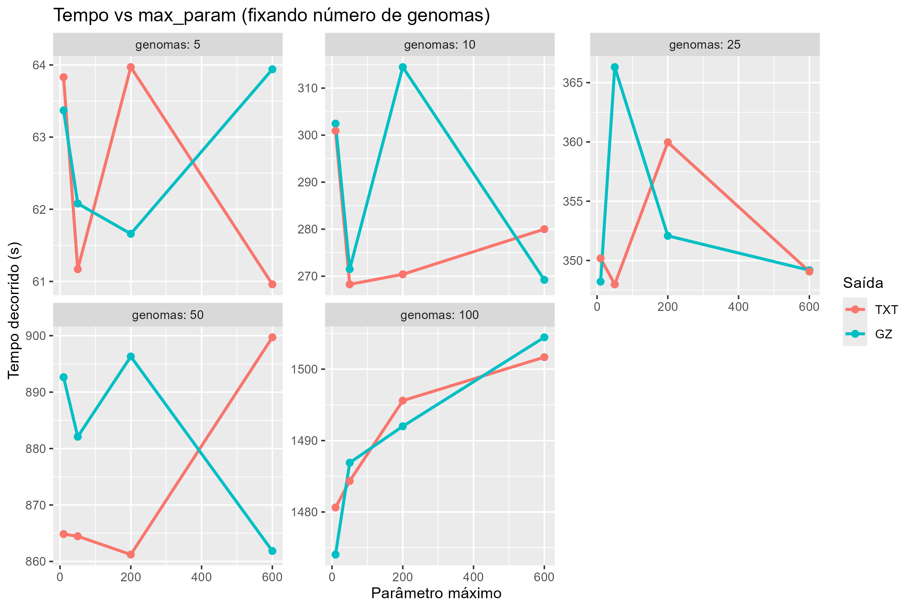
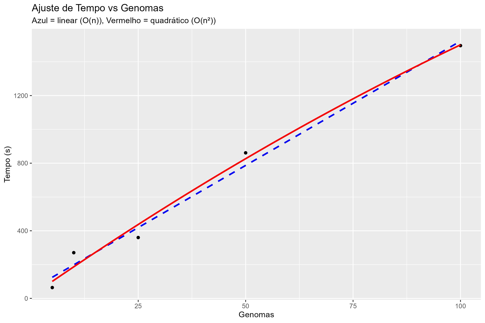
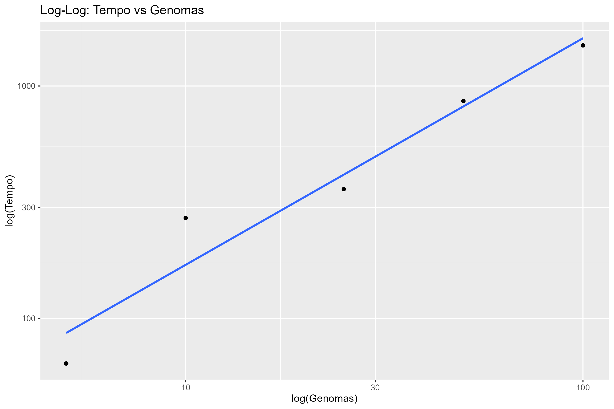

```{r setup, include=TRUE}
knitr::opts_chunk$set(echo = TRUE)
require(tidyverse)
require(stringr)
require(data.table)
require(lubridate)
require(knitr)
require(kableExtra)
require(formatR)
require(tinytex)
require(ggplot2)
require(dplyr)

```

# Considerações Gerais

Os arquivos do `fsm-lite` originais podem ser encontrados no Github:
[https://github.com/nvalimak/fsm-lite](https://github.com/nvalimak/fsm-lite)

Para facilitar o entendimento apenas os arquivos originais de maior importancia foram trascritos no item a seguir.


# Programa original


## Arquivo `fsm-lite.cpp` 

Arquivo: [original/fsm-lite.cpp](original/fsm-lite.cpp)

```{c, eval=FALSE, include=TRUE}
#include "default.h"
#include "configuration.h"
#include "input_reader.h"
#include <sdsl/suffix_trees.hpp> // TODO: replace with csa+lcp array
#include <sdsl/wt_algorithm.hpp>
#include <iostream>
#include <vector>
#include <cstdlib> // std::exit()
using namespace std;

typedef sdsl::cst_sct3<> cst_t;
typedef sdsl::wt_int<> wt_t;
typedef sdsl::bit_vector bitv_t;
typedef cst_t::char_type char_type;
typedef cst_t::node_type node_type;
typedef wt_t::size_type size_type;

/**
 * Construct the sequence labels
 *
 * Assumes that the number of input files is less than 2^DBITS.
 * The value of DBITS has to be set at compile time (in defaults.h).
 * Large DBITS values result in large memory requirements for wt_init().
 */
void wt_init(wt_t &wt, bitv_t &separator, cst_t &cst, input_reader *ir, configuration &config)
{
    uint64_t n = cst.csa.size();
    sdsl::int_vector<DBITS> labels(n, ~0u);
    separator = bitv_t(n, 0);
    uint64_t k = ir->size()-1;
    uint64_t j = cst.csa.wavelet_tree.select(1, 0);
    if (config.debug)
        cerr << "bwt end marker pos = " << j << endl;
    uint64_t bwtendpos = j;
    j = cst.csa.lf[j];
    labels[j] = 0;  // Label of last byte
    separator[n-1] = 0;
    separator[n-2] = 1;
    j = cst.csa.lf[j];
    for (uint64_t i = n-2; i > 0; i--) {
        char_type c = cst.csa.bwt[j];
        labels[j] = k;
        if (c == '$')
            k --;
        if (c == '$' || c == '#')
            separator[i-1] = 1;
        
        j = cst.csa.lf[j];
    }
    labels[j] = k;
    if (j != bwtendpos || k != 0) // Assert
    {
        cerr << "Labeling failed, j = " << j << ", k = " << k << endl;
        exit(1);
    }

    //TODO cleanup
    /*for (uint64_t i = 0; i < n; ++i) 
        cerr << cst.csa.text[i];
    cerr << endl;
    for (uint64_t i = 0; i < n; ++i) 
        cerr << separator[i];
    cerr << endl;
    for (uint64_t i = 0; i < n; ++i) 
        cerr << labels[cst.csa.isa[i]];
    cerr << endl;
    */  
        
    std::string tmp_file = sdsl::ram_file_name(sdsl::util::to_string(sdsl::util::pid())+"_"+sdsl::util::to_string(sdsl::util::id()));
    sdsl::store_to_file(labels, tmp_file);
    sdsl::int_vector_buffer<DBITS> text_buf(tmp_file);
    wt = wt_t(text_buf, labels.size());
    if (config.debug)
        cerr << "wt size = " << wt.size() << ", n = " << n << endl;
    j = 0;
    for (uint64_t i = 0; i < ir->size(); ++i)
        j += wt.rank(n, i);
    if (j != n) // Assert
    {
        cerr << "Label sum failed, j = " << j << ", n = " << n << endl;
        exit(1);
    }
    
}
    
int main(int argc, char ** argv)
{
    configuration config(argc, argv);
    if (!config.good)
        config.print_short_usage();

    if (config.verbose)
        cerr << "Reading input files..." << endl;
    input_reader *ir = input_reader::build(config);
    if (config.verbose)
        cerr << "Read " << ir->size() << " input files and " << ir->total_seqs() << " sequences of total length " << ir->total_size() << " (includes rev.compl. sequences)" << endl;
    
    /**
     * Initialize the data structures
     */
    if (config.verbose)
        cerr << "Constructing the data structures..." << endl;
    cst_t cst;    
    construct(cst, config.tmpfile + ".tmp", 1);
    if (!cst.csa.size())
    {
        cerr << "error: unable to construct the data structure; out of memory?" << endl; 
        abort();
    }
    
    wt_t label_wt;
    bitv_t separator;
    wt_init(label_wt, separator, cst, ir, config);

    bitv_t::rank_1_type sep_rank1(&separator);
    //bitv_t::select_1_type sep_select1(&separator); TODO Remove?
    assert(sep_rank1(cst.size()) == ir->total_seqs());
    
    size_type support = 0;
    vector<wt_t::value_type> labels(ir->size(), 0);
    vector<size_type> rank_sp(ir->size(), 0);
    vector<size_type> rank_ep(ir->size(), 0);

    if (config.verbose)
        cerr << "Construction complete, the main index requires " << size_in_mega_bytes(cst) << " MiB plus " << size_in_mega_bytes(label_wt) << " MiB for labels." << endl;
    
    /**
     * Main loop
     */
    node_type root = cst.root();
    vector<node_type> buffer;
    buffer.reserve(1024*1024);
    for (auto& child: cst.children(root))
        buffer.push_back(child);
    while (!buffer.empty())
    {
        node_type const node = buffer.back();
        buffer.pop_back();        
        unsigned depth = cst.depth(node);
        if (depth < config.maxlength)
            for (auto& child: cst.children(node))
                buffer.push_back(child);
        if (depth < config.minlength)
            continue;
        if (cst.is_leaf(node))
            continue;
        
        // Process the candidate node
        size_type sp = cst.lb(node);
        size_type ep = cst.rb(node);
        node_type wn = cst.wl(node, cst.csa.bwt[sp]);
        /*if (config.debug)
        {
            size_type pos = cst.csa[sp];
            auto s = extract(cst.csa, pos, pos + depth - 1);
            cerr << "at node = " << depth << "-[" << sp << "," << ep << "], wl = " << (wn != root);
            if (wn!=root)
                cerr << "[" << cst.rb(wn)-cst.lb(wn) << " vs " << ep-sp << "]";
            cerr << ", seq = " << s << endl;
            }*/
        if (wn == root && config.debug)
        {
            cerr << "warning: no Weiner-link at " << depth << "-[" << sp << "," << ep << "]" << endl;
            continue;
        }
        if (depth < config.maxlength && cst.rb(wn)-cst.lb(wn) == ep-sp)
            continue; // not left-branching

        sdsl::interval_symbols(label_wt, sp, ep+1, support, labels, rank_sp, rank_ep);
        if (support < config.minsupport || support > config.maxsupport)
            continue;
        
        size_type truesupp = 0;
        for (size_type i = 0; i < support; ++i)
            if (config.minfreq <= rank_ep[i]-rank_sp[i])
                ++truesupp;
        if (truesupp < config.minsupport)
            continue;
        
        if (depth > config.maxlength)
            depth = config.maxlength;
        size_type pos = cst.csa[sp];
        // Check for separator symbol TODO cleanup
        /*unsigned p_depth = cst.depth(cst.parent(node));
        if (sep_rank1(pos) != sep_rank1(pos + p_depth))
            continue; // Separator occurs above parent node
        if (sep_rank1(pos) != sep_rank1(pos + depth))
            depth = sep_select1(sep_rank1(pos)+1) - pos +1; // Separator above current node      
        */
        
        if (sep_rank1(pos) != sep_rank1(pos + depth))
            continue;
        auto s = extract(cst.csa, pos, pos + depth - 1);
        if (input_reader::smaller_than_rev_cmpl(s))
            continue;
        cout << s + " |";
        for (size_type i = 0; i < support; ++i)
            if (config.minfreq <= rank_ep[i]-rank_sp[i])
                cout << ' ' << ir->id(labels[i]) << ':' << rank_ep[i]-rank_sp[i];
        cout << '\n';
    }
    
    if (config.verbose)
        cerr << "All done." << endl;    
    delete ir; ir = 0;
    return 0;
}
```

## Arquivo `Makefile`

Arquivo: [original/Makefile](original/Makefile)

```{bash eval=FALSE, include=TRUE}
SDSL_INSTALL_PREFIX=${HOME}/software

CPPFLAGS=-std=c++11 -I$(SDSL_INSTALL_PREFIX)/include -DNDEBUG -O3 -msse4.2
LIBS=-lsdsl -ldivsufsort -ldivsufsort64
OBJ = configuration.o input_reader.o fsm-lite.o

fsm-lite: $(OBJ)
	$(LINK.cpp) $^ -L$(SDSL_INSTALL_PREFIX)/lib $(LIBS) -o $@

test: fsm-lite
	./fsm-lite -l test.list -t tmp -v --debug -m 1

clean:
	$(RM) fsm-lite *.o *~

depend:
	g++ -MM -std=c++11 -I$(SDSL_INSTALL_PREFIX)/include *.cpp > dependencies.mk

include dependencies.mk

```

# Versão 1.0 (original)

## Objetivo nessa versão:

- Instalação de pre-requisitos
- Compilação
- Teste de funcionamento basico
- Controle de versão em Github
- Script de excussão com monitoramento padronizado
- Testes com diferentes Ns e parametros

## Pre-requisitos:

- Ter listagem de genomas
- Ter acesso e permissão de leitura dos genomas
- Ter o `sdsl-lite v2.0.3` (versõa recomendada pelo fsm-lite original) instalado na home

Fonte do `sdsl-lite v2.0.3`: 
[https://github.com/simongog/sdsl-lite/releases/tag/v2.0.3](https://github.com/simongog/sdsl-lite/releases/tag/v2.0.3)

Instalação do `sdsl-lite v2.0.3`: 

```{bash eval=FALSE, include=FALSE}
$ cd sdsl-lite-2.0.3/
$ ./install.sh 
$ cd
$ cd LACTAS-HELISSON-01/Helena-stuff/fsm-lite/v2-0/

```

```{bash eval=FALSE, include=TRUE}
helena.despindula@BIOINFO08:$ cd ~/sdsl-lite-2.0.3

helena.despindula@BIOINFO08:$ mkdir -p build

helena.despindula@BIOINFO08:~/sdsl-lite-2.0.3$ cd build

helena.despindula@BIOINFO08:~/sdsl-lite-2.0.3/build$ cmake .. -DCMAKE_INSTALL_PREFIX=$HOME/sdsl-lite-2.0.3
-- Compiler is recent enough to support C++11.
-- Performing Test HAVE_GCC_STD=C__11__WALL__WEXTRA___DNDEBUG
-- Performing Test HAVE_GCC_STD=C__11__WALL__WEXTRA___DNDEBUG - Success
CMake Warning (dev) at external/gtest-1.6.0/CMakeLists.txt:42 (project):
  Policy CMP0048 is not set: project() command manages VERSION variables.
  Run "cmake --help-policy CMP0048" for policy details.  Use the cmake_policy
  command to set the policy and suppress this warning.

  The following variable(s) would be set to empty:

    PROJECT_VERSION
    PROJECT_VERSION_MAJOR
    PROJECT_VERSION_MINOR
    PROJECT_VERSION_PATCH
This warning is for project developers.  Use -Wno-dev to suppress it.

CMake Warning (dev) at external/libdivsufsort-2.0.1/CMakeLists.txt:19 (project):
  Policy CMP0048 is not set: project() command manages VERSION variables.
  Run "cmake --help-policy CMP0048" for policy details.  Use the cmake_policy
  command to set the policy and suppress this warning.

  The following variable(s) would be set to empty:

    PROJECT_VERSION
    PROJECT_VERSION_MAJOR
    PROJECT_VERSION_MINOR
    PROJECT_VERSION_PATCH
This warning is for project developers.  Use -Wno-dev to suppress it.

-- Configuring done
-- Generating done
-- Build files have been written to: /home/helena.despindula/sdsl-lite-2.0.3/build

helena.despindula@BIOINFO08:~/sdsl-lite-2.0.3/build$ make -j$(nproc)
[  4%] Built target gtest
[ 15%] Built target divsufsort64
[ 27%] Built target divsufsort
[ 95%] Built target sdsl
[100%] Built target gtest_main

helena.despindula@BIOINFO08:~/sdsl-lite-2.0.3/build$ make install
[  4%] Built target gtest
[  9%] Built target gtest_main
[ 20%] Built target divsufsort64
[ 31%] Built target divsufsort
[100%] Built target sdsl
Install the project...
-- Install configuration: "Release"
-- Installing: /home/helena.despindula/sdsl-lite-2.0.3/include/divsufsort.h
-- Installing: /home/helena.despindula/sdsl-lite-2.0.3/include/divsufsort64.h
-- Installing: /home/helena.despindula/sdsl-lite-2.0.3/lib/libdivsufsort.a
-- Installing: /home/helena.despindula/sdsl-lite-2.0.3/lib/libdivsufsort64.a
-- Installing: /home/helena.despindula/sdsl-lite-2.0.3/include/sdsl/bit_vector_il.hpp
-- Installing: /home/helena.despindula/sdsl-lite-2.0.3/include/sdsl/bit_vectors.hpp
-- Installing: /home/helena.despindula/sdsl-lite-2.0.3/include/sdsl/bits.hpp
-- Installing: /home/helena.despindula/sdsl-lite-2.0.3/include/sdsl/bp_support.hpp
-- Installing: /home/helena.despindula/sdsl-lite-2.0.3/include/sdsl/bp_support_algorithm.hpp
-- Installing: /home/helena.despindula/sdsl-lite-2.0.3/include/sdsl/bp_support_g.hpp
-- Installing: /home/helena.despindula/sdsl-lite-2.0.3/include/sdsl/bp_support_gg.hpp
-- Installing: /home/helena.despindula/sdsl-lite-2.0.3/include/sdsl/bp_support_sada.hpp
-- Installing: /home/helena.despindula/sdsl-lite-2.0.3/include/sdsl/coder.hpp
-- Installing: /home/helena.despindula/sdsl-lite-2.0.3/include/sdsl/coder_comma.hpp
-- Installing: /home/helena.despindula/sdsl-lite-2.0.3/include/sdsl/coder_elias_delta.hpp
-- Installing: /home/helena.despindula/sdsl-lite-2.0.3/include/sdsl/coder_elias_gamma.hpp
-- Installing: /home/helena.despindula/sdsl-lite-2.0.3/include/sdsl/coder_fibonacci.hpp
-- Installing: /home/helena.despindula/sdsl-lite-2.0.3/include/sdsl/config.hpp
-- Installing: /home/helena.despindula/sdsl-lite-2.0.3/include/sdsl/construct.hpp
-- Installing: /home/helena.despindula/sdsl-lite-2.0.3/include/sdsl/construct_bwt.hpp
-- Installing: /home/helena.despindula/sdsl-lite-2.0.3/include/sdsl/construct_config.hpp
-- Installing: /home/helena.despindula/sdsl-lite-2.0.3/include/sdsl/construct_isa.hpp
-- Installing: /home/helena.despindula/sdsl-lite-2.0.3/include/sdsl/construct_lcp.hpp
-- Installing: /home/helena.despindula/sdsl-lite-2.0.3/include/sdsl/construct_lcp_helper.hpp
-- Installing: /home/helena.despindula/sdsl-lite-2.0.3/include/sdsl/construct_sa.hpp
-- Installing: /home/helena.despindula/sdsl-lite-2.0.3/include/sdsl/construct_sa_se.hpp
-- Installing: /home/helena.despindula/sdsl-lite-2.0.3/include/sdsl/csa_alphabet_strategy.hpp
-- Installing: /home/helena.despindula/sdsl-lite-2.0.3/include/sdsl/csa_bitcompressed.hpp
-- Installing: /home/helena.despindula/sdsl-lite-2.0.3/include/sdsl/csa_sada.hpp
-- Installing: /home/helena.despindula/sdsl-lite-2.0.3/include/sdsl/csa_sampling_strategy.hpp
-- Installing: /home/helena.despindula/sdsl-lite-2.0.3/include/sdsl/csa_wt.hpp
-- Installing: /home/helena.despindula/sdsl-lite-2.0.3/include/sdsl/cst_iterators.hpp
-- Installing: /home/helena.despindula/sdsl-lite-2.0.3/include/sdsl/cst_sada.hpp
-- Installing: /home/helena.despindula/sdsl-lite-2.0.3/include/sdsl/cst_sct3.hpp
-- Installing: /home/helena.despindula/sdsl-lite-2.0.3/include/sdsl/dac_vector.hpp
-- Installing: /home/helena.despindula/sdsl-lite-2.0.3/include/sdsl/enc_vector.hpp
-- Installing: /home/helena.despindula/sdsl-lite-2.0.3/include/sdsl/fast_cache.hpp
-- Installing: /home/helena.despindula/sdsl-lite-2.0.3/include/sdsl/int_vector.hpp
-- Installing: /home/helena.despindula/sdsl-lite-2.0.3/include/sdsl/int_vector_buffer.hpp
-- Installing: /home/helena.despindula/sdsl-lite-2.0.3/include/sdsl/int_vector_io_wrappers.hpp
-- Installing: /home/helena.despindula/sdsl-lite-2.0.3/include/sdsl/int_vector_mapper.hpp
-- Installing: /home/helena.despindula/sdsl-lite-2.0.3/include/sdsl/inv_perm_support.hpp
-- Installing: /home/helena.despindula/sdsl-lite-2.0.3/include/sdsl/io.hpp
-- Installing: /home/helena.despindula/sdsl-lite-2.0.3/include/sdsl/iterators.hpp
-- Installing: /home/helena.despindula/sdsl-lite-2.0.3/include/sdsl/k2_treap.hpp
-- Installing: /home/helena.despindula/sdsl-lite-2.0.3/include/sdsl/k2_treap_algorithm.hpp
-- Installing: /home/helena.despindula/sdsl-lite-2.0.3/include/sdsl/k2_treap_helper.hpp
-- Installing: /home/helena.despindula/sdsl-lite-2.0.3/include/sdsl/lcp.hpp
-- Installing: /home/helena.despindula/sdsl-lite-2.0.3/include/sdsl/lcp_bitcompressed.hpp
-- Installing: /home/helena.despindula/sdsl-lite-2.0.3/include/sdsl/lcp_byte.hpp
-- Installing: /home/helena.despindula/sdsl-lite-2.0.3/include/sdsl/lcp_dac.hpp
-- Installing: /home/helena.despindula/sdsl-lite-2.0.3/include/sdsl/lcp_support_sada.hpp
-- Installing: /home/helena.despindula/sdsl-lite-2.0.3/include/sdsl/lcp_support_tree.hpp
-- Installing: /home/helena.despindula/sdsl-lite-2.0.3/include/sdsl/lcp_support_tree2.hpp
-- Installing: /home/helena.despindula/sdsl-lite-2.0.3/include/sdsl/lcp_vlc.hpp
-- Installing: /home/helena.despindula/sdsl-lite-2.0.3/include/sdsl/lcp_wt.hpp
-- Installing: /home/helena.despindula/sdsl-lite-2.0.3/include/sdsl/louds_tree.hpp
-- Installing: /home/helena.despindula/sdsl-lite-2.0.3/include/sdsl/memory_management.hpp
-- Installing: /home/helena.despindula/sdsl-lite-2.0.3/include/sdsl/nearest_neighbour_dictionary.hpp
-- Installing: /home/helena.despindula/sdsl-lite-2.0.3/include/sdsl/nn_dict_dynamic.hpp
-- Installing: /home/helena.despindula/sdsl-lite-2.0.3/include/sdsl/qsufsort.hpp
-- Installing: /home/helena.despindula/sdsl-lite-2.0.3/include/sdsl/ram_filebuf.hpp
-- Installing: /home/helena.despindula/sdsl-lite-2.0.3/include/sdsl/ram_fs.hpp
-- Installing: /home/helena.despindula/sdsl-lite-2.0.3/include/sdsl/rank_support.hpp
-- Installing: /home/helena.despindula/sdsl-lite-2.0.3/include/sdsl/rank_support_scan.hpp
-- Installing: /home/helena.despindula/sdsl-lite-2.0.3/include/sdsl/rank_support_v.hpp
-- Installing: /home/helena.despindula/sdsl-lite-2.0.3/include/sdsl/rank_support_v5.hpp
-- Installing: /home/helena.despindula/sdsl-lite-2.0.3/include/sdsl/rmq_succinct_sada.hpp
-- Installing: /home/helena.despindula/sdsl-lite-2.0.3/include/sdsl/rmq_succinct_sct.hpp
-- Installing: /home/helena.despindula/sdsl-lite-2.0.3/include/sdsl/rmq_support.hpp
-- Installing: /home/helena.despindula/sdsl-lite-2.0.3/include/sdsl/rmq_support_sparse_table.hpp
-- Installing: /home/helena.despindula/sdsl-lite-2.0.3/include/sdsl/rrr_helper.hpp
-- Installing: /home/helena.despindula/sdsl-lite-2.0.3/include/sdsl/rrr_vector.hpp
-- Installing: /home/helena.despindula/sdsl-lite-2.0.3/include/sdsl/rrr_vector_15.hpp
-- Installing: /home/helena.despindula/sdsl-lite-2.0.3/include/sdsl/sd_vector.hpp
-- Installing: /home/helena.despindula/sdsl-lite-2.0.3/include/sdsl/sdsl_concepts.hpp
-- Installing: /home/helena.despindula/sdsl-lite-2.0.3/include/sdsl/select_support.hpp
-- Installing: /home/helena.despindula/sdsl-lite-2.0.3/include/sdsl/select_support_mcl.hpp
-- Installing: /home/helena.despindula/sdsl-lite-2.0.3/include/sdsl/select_support_scan.hpp
-- Installing: /home/helena.despindula/sdsl-lite-2.0.3/include/sdsl/sfstream.hpp
-- Installing: /home/helena.despindula/sdsl-lite-2.0.3/include/sdsl/sorted_int_stack.hpp
-- Installing: /home/helena.despindula/sdsl-lite-2.0.3/include/sdsl/sorted_multi_stack_support.hpp
-- Installing: /home/helena.despindula/sdsl-lite-2.0.3/include/sdsl/sorted_stack_support.hpp
-- Installing: /home/helena.despindula/sdsl-lite-2.0.3/include/sdsl/structure_tree.hpp
-- Installing: /home/helena.despindula/sdsl-lite-2.0.3/include/sdsl/suffix_array_algorithm.hpp
-- Installing: /home/helena.despindula/sdsl-lite-2.0.3/include/sdsl/suffix_array_helper.hpp
-- Installing: /home/helena.despindula/sdsl-lite-2.0.3/include/sdsl/suffix_arrays.hpp
-- Installing: /home/helena.despindula/sdsl-lite-2.0.3/include/sdsl/suffix_tree_algorithm.hpp
-- Installing: /home/helena.despindula/sdsl-lite-2.0.3/include/sdsl/suffix_tree_helper.hpp
-- Installing: /home/helena.despindula/sdsl-lite-2.0.3/include/sdsl/suffix_trees.hpp
-- Installing: /home/helena.despindula/sdsl-lite-2.0.3/include/sdsl/uint128_t.hpp
-- Installing: /home/helena.despindula/sdsl-lite-2.0.3/include/sdsl/uint256_t.hpp
-- Installing: /home/helena.despindula/sdsl-lite-2.0.3/include/sdsl/uintx_t.hpp
-- Installing: /home/helena.despindula/sdsl-lite-2.0.3/include/sdsl/util.hpp
-- Installing: /home/helena.despindula/sdsl-lite-2.0.3/include/sdsl/vectors.hpp
-- Installing: /home/helena.despindula/sdsl-lite-2.0.3/include/sdsl/vlc_vector.hpp
-- Installing: /home/helena.despindula/sdsl-lite-2.0.3/include/sdsl/wavelet_trees.hpp
-- Installing: /home/helena.despindula/sdsl-lite-2.0.3/include/sdsl/wm_int.hpp
-- Installing: /home/helena.despindula/sdsl-lite-2.0.3/include/sdsl/wt_algorithm.hpp
-- Installing: /home/helena.despindula/sdsl-lite-2.0.3/include/sdsl/wt_blcd.hpp
-- Installing: /home/helena.despindula/sdsl-lite-2.0.3/include/sdsl/wt_gmr.hpp
-- Installing: /home/helena.despindula/sdsl-lite-2.0.3/include/sdsl/wt_helper.hpp
-- Installing: /home/helena.despindula/sdsl-lite-2.0.3/include/sdsl/wt_huff.hpp
-- Installing: /home/helena.despindula/sdsl-lite-2.0.3/include/sdsl/wt_hutu.hpp
-- Installing: /home/helena.despindula/sdsl-lite-2.0.3/include/sdsl/wt_int.hpp
-- Installing: /home/helena.despindula/sdsl-lite-2.0.3/include/sdsl/wt_pc.hpp
-- Installing: /home/helena.despindula/sdsl-lite-2.0.3/include/sdsl/wt_rlmn.hpp
-- Installing: /home/helena.despindula/sdsl-lite-2.0.3/lib/libsdsl.a

helena.despindula@BIOINFO08:~/sdsl-lite-2.0.3/build$ ls ~/sdsl-lite-2.0.3/lib/lib*.a
/home/helena.despindula/sdsl-lite-2.0.3/lib/libdivsufsort64.a  /home/helena.despindula/sdsl-lite-2.0.3/lib/libdivsufsort.a  /home/helena.despindula/sdsl-lite-2.0.3/lib/libsdsl.a

helena.despindula@BIOINFO08:~/sdsl-lite-2.0.3/build$ cd

helena.despindula@BIOINFO08:~$ cd LACTAS-HELISSON-01/Helena-stuff/fsm-lite/v2-0/

helena.despindula@BIOINFO08:~/LACTAS-HELISSON-01/Helena-stuff/fsm-lite/v2-0$ ls
configuration.cpp  default.h                 execussao_padronizada_v2_0.sh  input_fsm-lite_OXA-23_OXA-24_05.txt   input_reader.h  Makefile
configuration.h    dependencies.mk           fsm-lite.cpp                   input_fsm-lite_OXA-23_OXA-24_100.txt  input_reader.o  README.md
configuration.o    execussao_padronizada.sh  fsm-lite.o                     input_reader.cpp                      LICENSE.md
```


## Compilação do `fsm-lite` e Teste de funcionamento basico

### Github

O `fsm-lite` foi primeiramente obtido do github e tentado instalar com `make depend && make` conforme instruções do README.mk

2. Devido a um serie de erros de compilacao foi necessario alterar o `Makefile` para:incluir as `$(CPPFLAGS)` no comando `g++`.

Ficou assim:

```{bash eval=FALSE, include=TRUE}
SDSL_INSTALL_PREFIX=${HOME}/sdsl-lite-2.0.3
DIVSUFSORT_INCLUDE=$(SDSL_INSTALL_PREFIX)/build/external/libdivsufsort-2.0.1/include

CPPFLAGS=-std=c++11 -I$(SDSL_INSTALL_PREFIX)/include -I$(DIVSUFSORT_INCLUDE) -DNDEBUG -O3 -msse4.2

LIBS=-lsdsl -ldivsufsort -ldivsufsort64
OBJ = configuration.o input_reader.o fsm-lite.o

fsm-lite: $(OBJ)
	$(LINK.cpp) $^ -L$(SDSL_INSTALL_PREFIX)/lib $(LIBS) -o $@

test: fsm-lite
	./fsm-lite -l test.list -t tmp -v --debug -m 1

clean:
	$(RM) fsm-lite *.o *~

depend:
	g++ -MM -std=c++11 $(CPPFLAGS) -I$(SDSL_INSTALL_PREFIX)/include *.cpp > dependencies.mk

include dependencies.mk
```


Execução do `make` no terminal com compilação bem sucedida:

```{bash eval=FALSE, include=TRUE}
helena.despindula@BIOINFO08:~/LACTAS-HELISSON-01/Helena-stuff/fsm-lite/v2-0$ make clean
rm -f fsm-lite *.o *~

helena.despindula@BIOINFO08:~/LACTAS-HELISSON-01/Helena-stuff/fsm-lite/v2-0$ make depend && make
g++ -MM -std=c++11 -std=c++11 -I/home/helena.despindula/sdsl-lite-2.0.3/include -I/home/helena.despindula/sdsl-lite-2.0.3/build/external/libdivsufsort-2.0.1/include -DNDEBUG -O3 -msse4.2 -I/home/helena.despindula/sdsl-lite-2.0.3/include *.cpp > dependencies.mk
g++  -std=c++11 -I/home/helena.despindula/sdsl-lite-2.0.3/include -I/home/helena.despindula/sdsl-lite-2.0.3/build/external/libdivsufsort-2.0.1/include -DNDEBUG -O3 -msse4.2  -c -o configuration.o configuration.cpp
g++  -std=c++11 -I/home/helena.despindula/sdsl-lite-2.0.3/include -I/home/helena.despindula/sdsl-lite-2.0.3/build/external/libdivsufsort-2.0.1/include -DNDEBUG -O3 -msse4.2  -c -o input_reader.o input_reader.cpp
g++  -std=c++11 -I/home/helena.despindula/sdsl-lite-2.0.3/include -I/home/helena.despindula/sdsl-lite-2.0.3/build/external/libdivsufsort-2.0.1/include -DNDEBUG -O3 -msse4.2  -c -o fsm-lite.o fsm-lite.cpp
g++  -std=c++11 -I/home/helena.despindula/sdsl-lite-2.0.3/include -I/home/helena.despindula/sdsl-lite-2.0.3/build/external/libdivsufsort-2.0.1/include -DNDEBUG -O3 -msse4.2   configuration.o input_reader.o fsm-lite.o -L/home/helena.despindula/sdsl-lite-2.0.3/lib -lsdsl -ldivsufsort -ldivsufsort64 -o fsm-lite

helena.despindula@BIOINFO08:~/LACTAS-HELISSON-01/Helena-stuff/fsm-lite/v2-0$ ls
configuration.cpp  configuration.o  dependencies.mk           execussao_padronizada_v2_0.sh  fsm-lite.cpp  input_fsm-lite_OXA-23_OXA-24_05.txt   input_reader.cpp  input_reader.o  Makefile
configuration.h    default.h   fsm-lite                       fsm-lite.o    input_fsm-lite_OXA-23_OXA-24_100.txt  input_reader.h    LICENSE.md      README.md

```

Então tentou-se uma excussão simples por linha de comando direta para teste.

Mas notou-se, que o programa não estava gerando os resultados (arquivo estava vazio). 


```{bash eval=FALSE, include=TRUE}
helena.despindula@BIOINFO08:~/LACTAS-HELISSON-01/Helena-stuff/fsm-lite/v2-0$ time ./fsm-lite -l input_fsm-lite_OXA-23_OXA-24_010.txt -v -t temp
Reading input files...
Read 10 input files and 1154 sequences of total length 80325904 (includes rev.compl. sequences)
Constructing the data structures...
Construction complete, the main index requires 230.716 MiB plus 56.9204 MiB for labels.
All done.

real	0m59,317s
user	0m55,163s
sys	0m3,206s

helena.despindula@BIOINFO08:~/LACTAS-HELISSON-01/Helena-stuff/fsm-lite/v2-0$ ls -a -l
total 80032
drwxrwxr-x 2 helena.despindula helena.despindula     8192 jul 23 22:19 .
drwxrwxr-x 7 helena.despindula helena.despindula     8192 jul 23 22:01 ..
-rw-rw-r-- 1 helena.despindula helena.despindula     4894 abr 12  2016 configuration.cpp
-rw-rw-r-- 1 helena.despindula helena.despindula      557 jul 22 22:44 configuration.h
-rw-rw-r-- 1 helena.despindula helena.despindula    20712 jul 23 22:15 configuration.o
-rw-rw-r-- 1 helena.despindula helena.despindula      173 abr 12  2016 default.h
-rw-rw-r-- 1 helena.despindula helena.despindula     7639 jul 23 22:15 dependencies.mk
-rwxrwxr-x 1 helena.despindula helena.despindula     2714 jul 22 14:32 execussao_padronizada_v2_0_2.sh
-rwxrwxr-x 1 helena.despindula helena.despindula     3289 jul 23 22:01 execussao_padronizada_v2_0_3.sh
-rwxrwxr-x 1 helena.despindula helena.despindula     3294 jul 23 22:01 execussao_padronizada_v2_0_4.sh
-rwxrwxr-x 1 helena.despindula helena.despindula     2571 jul 22 14:29 execussao_padronizada_v2_0.sh
-rwxrwxr-x 1 helena.despindula helena.despindula   778176 jul 23 22:16 fsm-lite
-rw-rw-r-- 1 helena.despindula helena.despindula     6468 jul 23 22:14 fsm-lite.cpp
-rw-rw-r-- 1 helena.despindula helena.despindula   482424 jul 23 22:16 fsm-lite.o
-rw-rw-r-- 1 helena.despindula helena.despindula     1449 jul 22 15:39 input_fsm-lite_OXA-23_OXA-24_010.txt
-rw-rw-r-- 1 helena.despindula helena.despindula     2888 jul 22 16:03 input_fsm-lite_OXA-23_OXA-24_020.txt
-rw-rw-r-- 1 helena.despindula helena.despindula     5669 abr 12  2016 input_reader.cpp
-rw-rw-r-- 1 helena.despindula helena.despindula     1676 jul 22 22:44 input_reader.h
-rw-rw-r-- 1 helena.despindula helena.despindula    38632 jul 23 22:15 input_reader.o
-rw-rw-r-- 1 helena.despindula helena.despindula    35141 abr 12  2016 LICENSE.md
-rw-rw-r-- 1 helena.despindula helena.despindula      613 jul 22 13:30 Makefile
-rw-rw-r-- 1 helena.despindula helena.despindula     1301 abr 12  2016 README.md
-rw-rw-r-- 1 helena.despindula helena.despindula      250 jul 23 22:16 temp.meta
-rw-rw-r-- 1 helena.despindula helena.despindula 80325904 jul 23 22:16 temp.tmp
```

### Conda

Devido aos problemas de instalação tentamos usar a versão do `conda` do `sdsl-lite` e do `fsm-lite` no ambiente `fsm-lite-conda`.

Instalação: 
```{bash eval=FALSE, include=TRUE}

(fsm-lite-conda) helena.despindula@BIOINFO08:~$ conda install conda-forge::sdsl-lite 
/usr/local/miniconda3/lib/python3.9/site-packages/conda/base/context.py:211: FutureWarning: Adding 'defaults' to channel list implicitly is deprecated and will be removed in 25.9. 

To remove this warning, please choose a default channel explicitly with conda's regular configuration system, e.g. by adding 'defaults' to the list of channels:

  conda config --add channels defaults

For more information see https://docs.conda.io/projects/conda/en/stable/user-guide/configuration/use-condarc.html

  deprecated.topic(
Channels:
 - defaults
 - conda-forge
Platform: linux-64
Collecting package metadata (repodata.json): done
Solving environment: done

## Package Plan ##

  environment location: /home/helena.despindula/.conda/envs/fsm-lite-conda

  added / updated specs:
    - conda-forge::sdsl-lite


The following packages will be downloaded:

    package                    |            build
    ---------------------------|-----------------
    libgcc-15.1.0              |       h767d61c_4         805 KB  conda-forge
    libgcc-ng-15.1.0           |       h69a702a_4          29 KB  conda-forge
    libgomp-15.1.0             |       h767d61c_4         437 KB  conda-forge
    libstdcxx-15.1.0           |       h8f9b012_4         3.7 MB  conda-forge
    libstdcxx-ng-15.1.0        |       h4852527_4          29 KB  conda-forge
    ------------------------------------------------------------
                                           Total:         5.0 MB

The following NEW packages will be INSTALLED:

  _libgcc_mutex      pkgs/main/linux-64::_libgcc_mutex-0.1-main 
  _openmp_mutex      pkgs/main/linux-64::_openmp_mutex-5.1-1_gnu 
  libgcc             conda-forge/linux-64::libgcc-15.1.0-h767d61c_4 
  libgcc-ng          conda-forge/linux-64::libgcc-ng-15.1.0-h69a702a_4 
  libgomp            conda-forge/linux-64::libgomp-15.1.0-h767d61c_4 
  libstdcxx          conda-forge/linux-64::libstdcxx-15.1.0-h8f9b012_4 
  libstdcxx-ng       conda-forge/linux-64::libstdcxx-ng-15.1.0-h4852527_4 
  sdsl-lite          conda-forge/linux-64::sdsl-lite-2.1.1-h00ab1b0_1002 


Proceed ([y]/n)? y


Downloading and Extracting Packages:
                                                                                                                                                                                                 
Preparing transaction: done                                                                                                                                                                      
Verifying transaction: done                                                                                                                                                                      
Executing transaction: done                       


                                                                                                                                               
(fsm-lite-conda) helena.despindula@BIOINFO08:~$ conda install bioconda::fsm-lite                                                                                                             
/usr/local/miniconda3/lib/python3.9/site-packages/conda/base/context.py:211: FutureWarning: Adding 'defaults' to channel list implicitly is deprecated and will be removed in 25.9. 

To remove this warning, please choose a default channel explicitly with conda's regular configuration system, e.g. by adding 'defaults' to the list of channels:

  conda config --add channels defaults

For more information see https://docs.conda.io/projects/conda/en/stable/user-guide/configuration/use-condarc.html

  deprecated.topic(
Channels:
 - defaults
 - bioconda
Platform: linux-64
Collecting package metadata (repodata.json): done
Solving environment: done

## Package Plan ##

  environment location: /home/helena.despindula/.conda/envs/fsm-lite-conda

  added / updated specs:
    - bioconda::fsm-lite


The following packages will be downloaded:

    package                    |            build
    ---------------------------|-----------------
    fsm-lite-1.0               |       h9948957_6         251 KB  bioconda
    ------------------------------------------------------------
                                           Total:         251 KB

The following NEW packages will be INSTALLED:

  fsm-lite           bioconda/linux-64::fsm-lite-1.0-h9948957_6 


Proceed ([y]/n)? y


Downloading and Extracting Packages:
                                                                                                                                                                                                 
Preparing transaction: done
Verifying transaction: done
Executing transaction: done
(fsm-lite-conda) helena.despindula@BIOINFO08:~$ fsm-li
fsm-li: command not found
(fsm-lite-conda) helena.despindula@BIOINFO08:~$ fsm-lite


(fsm-lite-conda) helena.despindula@BIOINFO08:~$ conda list --explicit
# This file may be used to create an environment using:
# $ conda create --name <env> --file <this file>
# platform: linux-64
# created-by: conda 25.5.1
@EXPLICIT
https://repo.anaconda.com/pkgs/main/linux-64/_libgcc_mutex-0.1-main.conda
https://conda.anaconda.org/conda-forge/linux-64/libgomp-15.1.0-h767d61c_4.conda
https://repo.anaconda.com/pkgs/main/linux-64/_openmp_mutex-5.1-1_gnu.conda
https://conda.anaconda.org/conda-forge/linux-64/libgcc-15.1.0-h767d61c_4.conda
https://conda.anaconda.org/conda-forge/linux-64/libgcc-ng-15.1.0-h69a702a_4.conda
https://conda.anaconda.org/conda-forge/linux-64/libstdcxx-15.1.0-h8f9b012_4.conda
https://conda.anaconda.org/conda-forge/linux-64/libstdcxx-ng-15.1.0-h4852527_4.conda
https://conda.anaconda.org/conda-forge/linux-64/sdsl-lite-2.1.1-h00ab1b0_1002.conda
https://conda.anaconda.org/bioconda/linux-64/fsm-lite-1.0-h9948957_6.tar.bz2


(fsm-lite-conda) helena.despindula@BIOINFO08:~/LACTAS-HELISSON-01/Helena-stuff/fsm-lite/v2_2$ conda install conda-forge::msmtp-sendmail
/usr/local/miniconda3/lib/python3.9/site-packages/conda/base/context.py:211: FutureWarning: Adding 'defaults' to channel list implicitly is deprecated and will be removed in 25.9. 

To remove this warning, please choose a default channel explicitly with conda's regular configuration system, e.g. by adding 'defaults' to the list of channels:

  conda config --add channels defaults

For more information see https://docs.conda.io/projects/conda/en/stable/user-guide/configuration/use-condarc.html

  deprecated.topic(
Retrieving notices: done
/usr/local/miniconda3/lib/python3.9/site-packages/conda/base/context.py:211: FutureWarning: Adding 'defaults' to channel list implicitly is deprecated and will be removed in 25.9. 

To remove this warning, please choose a default channel explicitly with conda's regular configuration system, e.g. by adding 'defaults' to the list of channels:

  conda config --add channels defaults

For more information see https://docs.conda.io/projects/conda/en/stable/user-guide/configuration/use-condarc.html

  deprecated.topic(
Channels:
 - defaults
 - conda-forge
Platform: linux-64
Collecting package metadata (repodata.json): done
Solving environment: done

## Package Plan ##

  environment location: /home/helena.despindula/.conda/envs/fsm-lite-conda

  added / updated specs:
    - conda-forge::msmtp-sendmail


The following packages will be downloaded:

    package                    |            build
    ---------------------------|-----------------
    ca-certificates-2025.2.25  |       h06a4308_0         129 KB
    gmp-6.3.0                  |       h6a678d5_0         608 KB
    krb5-1.21.3                |       h723845a_3         286 KB
    libedit-3.1.20230828       |       h5eee18b_0         179 KB
    libffi-3.4.4               |       h6a678d5_1         141 KB
    libgcrypt-lib-1.11.1       |       hb9d3cd8_0         577 KB  conda-forge
    libgpg-error-1.55          |       h3f2d84a_0         305 KB  conda-forge
    libgsasl-2.2.2             |       h1bdc22f_0         206 KB  conda-forge
    libidn2-2.3.4              |       h5eee18b_0         146 KB
    libkrb5-1.21.3             |       h520c7b4_3         878 KB
    libntlm-1.8                |       hb9d3cd8_0          33 KB  conda-forge
    libunistring-0.9.10        |       h27cfd23_0         536 KB
    lmdb-0.9.29                |       h2531618_0         424 KB
    msmtp-1.8.30               |       hdce3e81_0         200 KB  conda-forge
    msmtp-sendmail-1.8.30      |       hfc2019e_0          19 KB  conda-forge
    ncurses-6.5                |       h7934f7d_0         1.1 MB
    openssl-3.0.17             |       h5eee18b_0         5.2 MB
    ------------------------------------------------------------
                                           Total:        10.9 MB

The following NEW packages will be INSTALLED:

  ca-certificates    pkgs/main/linux-64::ca-certificates-2025.2.25-h06a4308_0 
  gmp                pkgs/main/linux-64::gmp-6.3.0-h6a678d5_0 
  gnutls             conda-forge/linux-64::gnutls-3.8.9-h86084c0_1 
  krb5               pkgs/main/linux-64::krb5-1.21.3-h723845a_3 
  libedit            pkgs/main/linux-64::libedit-3.1.20230828-h5eee18b_0 
  libffi             pkgs/main/linux-64::libffi-3.4.4-h6a678d5_1 
  libgcrypt-lib      conda-forge/linux-64::libgcrypt-lib-1.11.1-hb9d3cd8_0 
  libgpg-error       conda-forge/linux-64::libgpg-error-1.55-h3f2d84a_0 
  libgsasl           conda-forge/linux-64::libgsasl-2.2.2-h1bdc22f_0 
  libidn2            pkgs/main/linux-64::libidn2-2.3.4-h5eee18b_0 
  libkrb5            pkgs/main/linux-64::libkrb5-1.21.3-h520c7b4_3 
  libntlm            conda-forge/linux-64::libntlm-1.8-hb9d3cd8_0 
  libtasn1           conda-forge/linux-64::libtasn1-4.20.0-hb9d3cd8_0 
  libunistring       pkgs/main/linux-64::libunistring-0.9.10-h27cfd23_0 
  lmdb               pkgs/main/linux-64::lmdb-0.9.29-h2531618_0 
  msmtp              conda-forge/linux-64::msmtp-1.8.30-hdce3e81_0 
  msmtp-sendmail     conda-forge/linux-64::msmtp-sendmail-1.8.30-hfc2019e_0 
  ncurses            pkgs/main/linux-64::ncurses-6.5-h7934f7d_0 
  nettle             conda-forge/linux-64::nettle-3.10.1-h4a9d5aa_0 
  openssl            pkgs/main/linux-64::openssl-3.0.17-h5eee18b_0 
  p11-kit            conda-forge/linux-64::p11-kit-0.24.1-hc5aa10d_0 


Proceed ([y]/n)? y


Downloading and Extracting Packages:
                                                                                                                                                                         
Preparing transaction: done                                                                                                                                              
Verifying transaction: done                                                                                                                                              
Executing transaction: done   

```


Teste de funcionamento:
```{bash eval=FALSE, include=TRUE}

(fsm-lite-conda) helena.despindula@BIOINFO08:~$ time fsm-lite -v --debug -m 2 -l LACTAS-HELISSON-01/Helena-stuff/fsm-lite/v2-0/input_fsm-lite_OXA-23_OXA-24_010.txt -t Desktop/temp > rest.txt
Reading input files...
Read 10 input files and 1154 sequences of total length 80325904 (includes rev.compl. sequences)
Constructing the data structures...
bwt end marker pos = 50209239
wt size = 80325905, n = 80325905
Construction complete, the main index requires 230.716 MiB plus 56.9204 MiB for labels.
All done.

real	6m56,624s
user	6m48,520s
sys	0m7,208s

```

Dessa vez o resultado não estava vazio. 

Suspeito-se de um problema com as bibliotecas. Então tentamso reinstalar manualmente o `fsm-lite` no ambiente conda `fsm-lite-conda` com o Makefile original da versão 1.0 (com o caminho para o sdsl-lite do conda) e o comando `make clean && make depend && make`.

Makefile

```{bash eval=FALSE, include=TRUE}
SDSL_INSTALL_PREFIX=/home/helena.despindula/.conda/pkgs/sdsl-lite-2.1.1-h00ab1b0_1002

CPPFLAGS=-std=c++11 -I$(SDSL_INSTALL_PREFIX)/include -DNDEBUG -O3 -msse4.2
LIBS=-lsdsl -ldivsufsort -ldivsufsort64
OBJ = configuration.o input_reader.o fsm-lite.o

fsm-lite: $(OBJ)
	$(LINK.cpp) $^ -L$(SDSL_INSTALL_PREFIX)/lib $(LIBS) -o $@

test: fsm-lite
	./fsm-lite -l test.list -t tmp -v --debug -m 1

clean:
	$(RM) fsm-lite *.o *~

depend:
	g++ -MM -std=c++11 -I$(SDSL_INSTALL_PREFIX)/include *.cpp > dependencies.mk

include dependencies.mk


```

Instalação:

```{bash eval=FALSE, include=TRUE}
(fsm-lite-conda) helena.despindula@BIOINFO08:~/LACTAS-HELISSON-01/Helena-stuff/fsm-lite/original$ make clean
rm -f fsm-lite *.o *~
(fsm-lite-conda) helena.despindula@BIOINFO08:~/LACTAS-HELISSON-01/Helena-stuff/fsm-lite/original$ make depend
g++ -MM -std=c++11 -I/home/helena.despindula/.conda/pkgs/sdsl-lite-2.1.1-h00ab1b0_1002/include *.cpp > dependencies.mk
(fsm-lite-conda) helena.despindula@BIOINFO08:~/LACTAS-HELISSON-01/Helena-stuff/fsm-lite/original$ make
g++  -std=c++11 -I/home/helena.despindula/.conda/pkgs/sdsl-lite-2.1.1-h00ab1b0_1002/include -DNDEBUG -O3 -msse4.2  -c -o configuration.o configuration.cpp
g++  -std=c++11 -I/home/helena.despindula/.conda/pkgs/sdsl-lite-2.1.1-h00ab1b0_1002/include -DNDEBUG -O3 -msse4.2  -c -o input_reader.o input_reader.cpp
g++  -std=c++11 -I/home/helena.despindula/.conda/pkgs/sdsl-lite-2.1.1-h00ab1b0_1002/include -DNDEBUG -O3 -msse4.2  -c -o fsm-lite.o fsm-lite.cpp
g++  -std=c++11 -I/home/helena.despindula/.conda/pkgs/sdsl-lite-2.1.1-h00ab1b0_1002/include -DNDEBUG -O3 -msse4.2   configuration.o input_reader.o fsm-lite.o -L/home/helena.despindula/.conda/pkgs/sdsl-lite-2.1.1-h00ab1b0_1002/lib -lsdsl -ldivsufsort -ldivsufsort64 -o fsm-lite
(fsm-lite-conda) helena.despindula@BIOINFO08:~/LACTAS-HELISSON-01/Helena-stuff/fsm-lite/original$ ./fsm-lite -v --debug -l ../v2-0/input_fsm-lite_OXA-23_OXA-24_010.txt -S 50 -m 2 -t temp > rescultados_conda.txt
Reading input files...
Read 10 input files and 1154 sequences of total length 80325904 (includes rev.compl. sequences)
Constructing the data structures...
bwt end marker pos = 50209239
wt size = 80325905, n = 80325905
Construction complete, the main index requires 230.716 MiB plus 56.9204 MiB for labels.
All done.
(fsm-lite-conda) helena.despindula@BIOINFO08:~/LACTAS-HELISSON-01/Helena-stuff/fsm-lite/original$ ls -lh
total 2,0G
-rw-rw-r-- 1 helena.despindula helena.despindula 4,8K abr 12  2016 configuration.cpp
-rw-rw-r-- 1 helena.despindula helena.despindula  557 abr 12  2016 configuration.h
-rw-rw-r-- 1 helena.despindula helena.despindula  21K ago  2 10:09 configuration.o
-rw-rw-r-- 1 helena.despindula helena.despindula  173 abr 12  2016 default.h
-rw-rw-r-- 1 helena.despindula helena.despindula  11K ago  2 10:09 dependencies.mk
-rwxrwxr-x 1 helena.despindula helena.despindula 801K ago  2 10:10 fsm-lite
-rw-rw-r-- 1 helena.despindula helena.despindula 6,9K jul 23 22:01 fsm-lite.cpp
-rw-rw-r-- 1 helena.despindula helena.despindula 479K ago  2 10:10 fsm-lite.o
-rw-rw-r-- 1 helena.despindula helena.despindula 5,6K abr 12  2016 input_reader.cpp
-rw-rw-r-- 1 helena.despindula helena.despindula 1,7K abr 12  2016 input_reader.h
-rw-rw-r-- 1 helena.despindula helena.despindula  38K ago  2 10:09 input_reader.o
-rw-rw-r-- 1 helena.despindula helena.despindula  35K abr 12  2016 LICENSE.md
-rw-rw-r-- 1 helena.despindula helena.despindula  533 ago  2 10:09 Makefile
-rw-rw-r-- 1 helena.despindula helena.despindula  484 abr 12  2016 Makefile-original
-rw-rw-r-- 1 helena.despindula helena.despindula 1,3K abr 12  2016 README.md
-rw-rw-r-- 1 helena.despindula helena.despindula 1,9G ago  2 10:19 rescultados_conda.txt
-rw-rw-r-- 1 helena.despindula helena.despindula  250 ago  2 10:13 temp.meta
-rw-rw-r-- 1 helena.despindula helena.despindula  77M ago  2 10:13 temp.tmp

```

Foi realizado novo teste e o funcionamento dessa vez foi normal.

## Criacao de controle de versao no github (`fork` do original):

Nossa versão para modificações e testes foi depositada no github a partir de fork do original.
[https://github.com/HelenaDEspindula/fsm-lite](https://github.com/HelenaDEspindula/fsm-lite)

## Criação de arquivo .sh para excussão padronizada

Para fins de comparação de desempenho foram utilizadas as 
Paramentros fixos:
- `./fsm-lite` uso do programa versão compilada local
- `--debug` de modo debug
- `-v` de modo verbose
- `-m 1` que indica que a sequencia deve estar presente em pelo menos 1 genoma

E a combinações dos seguintes paramentros variaveis (que tem maior chance de interferir do desempenho do programa):
- Numero de genomas: 5 10 25 50 100 250
- Paramento `-S`: 10 50 200 600
- Saida: `.txt` ou `.txt.gz`

Para avaliação utilizou-se o `/usr/bin/time` que a saber fornece:

- `Command being timed:`
- `User time (seconds)`
- `System time (seconds)`
- `Percent of CPU this job got`
- `Elapsed (wall clock) time (h:mm:ss or m:ss)`
- `Average shared text size (kbytes)`
- `Average unshared data size (kbytes)`
- `Average stack size (kbytes)`
- `Average total size (kbytes)`
- `Maximum resident set size (kbytes)`
- `Average resident set size (kbytes)`
- `Major (requiring I/O) page faults`
- `Minor (reclaiming a frame) page faults`
- `Voluntary context switches`
- `Involuntary context switches`
- `Swaps`
- `File system inputs`
- `File system outputs`
- `Socket messages sent`
- `Socket messages received`
- `Signals delivered`
- `Page size (bytes)`
- `Exit status`


Arquivo [fsm-lite/original/progressivo.sh](original/progressivo.sh)

```{bash eval=FALSE, include=TRUE}
#!/bin/bash

INPUT_FILE="/home/helena.despindula/LACTAS-HELISSON-01/Helena-stuff/input_fsm-lite_OXA-23_OXA-24_temp.txt"
LISTA="/home/helena.despindula/LACTAS-HELISSON-01/Helena-stuff/input_fsm-lite_OXA-23_OXA-24_todos.txt"
LOG_DIR="logs"
INTERVAL_MONITOR=30
GENOMAS=(5 10 25 50 100 250)
SMINUSCULO=6
SMAIUSCULO=(10 50 200 600)
MMINUSCULO=1
VERSION="1_0"
TMP_DIR="/home/helena.despindula/LACTAS-HELISSON-01/Helena-stuff/fsm-lite-temp"
RES_DIR="/home/helena.despindula/LACTAS-HELISSON-01/Helena-stuff/fsm-lite-results/${VERSION}"
TIMESTAMP=$(date +%Y-%m-%d_%H-%M-%S)

PROGRAMA="./fsm-lite"

# Criar pastas
mkdir -p "$LOG_DIR/monitor"
mkdir -p "$LOG_DIR/output"
mkdir -p "$TMP_DIR"
mkdir -p "$RES_DIR"

for N in "${GENOMAS[@]}"; do

  # Criar sublista
  head -n "$N" "$LISTA" > "$INPUT_FILE"

  for J in "${SMAIUSCULO[@]}"; do
  
    echo "============================="
  
    TIMESTAMP=$(date +%Y-%m-%d_%H-%M-%S)
    MONITOR_LOG="${LOG_DIR}/monitor/fsm_monitor_log_v${VERSION}_${N}genomas_${J}_max_TXT--${TIMESTAMP}.txt"
    OUTPUT_LOG="${LOG_DIR}/output/fsm_output_log_v${VERSION}_${N}genomas_${J}_max_TXT--${TIMESTAMP}.txt"
    TMP_FILES="${TMP_DIR}/fsm_tmp_files_v${VERSION}_${N}genomas_${J}_max_TXT--${TIMESTAMP}"
    OUTPUT_RES="${RES_DIR}/fsm_results_v${VERSION}_${N}genomas_${J}_max_TXT--${TIMESTAMP}.txt"
  
    
  
    echo "Rodando fsm-lite v${VERSION} saida TXT: para $N amostras com $J de maximo as ${TIMESTAMP}." > "$MONITOR_LOG"
    echo "Rodando fsm-lite v${VERSION} saida TXT: para $N amostras com $J de maximo as ${TIMESTAMP}." > "$OUTPUT_LOG"
    echo -e "timestamp\tcpu\tmem\tvsz\trss" >> "$MONITOR_LOG"
    
    echo "Rodando fsm-lite v${VERSION} saida TXT: para $N amostras com $J de maximo as ${TIMESTAMP}." > "$OUTPUT_RES"
  
    echo "Rodando fsm-lite v${VERSION} saida TXT: para $N amostras com $J de maximo as ${TIMESTAMP}."
    
    # Executar fsm-lite em background
    ( /usr/bin/time -v "$PROGRAMA" -l "$INPUT_FILE" -s $SMINUSCULO -S $SMAIUSCULO -m $MMINUSCULO --debug -v -t "$TMP_FILES" >> "$OUTPUT_RES" 2> "$OUTPUT_LOG" ) &
    FSM_PID=$!
  
    echo "Monitorando PID: $FSM_PID"
  
      # Monitorar enquanto o processo estiver rodando
      while kill -0 "$FSM_PID" 2>/dev/null; do
        timestamp=$(date +%s)
        ps -p "$FSM_PID" -o %cpu,%mem,vsz,rss --no-headers | \
          awk -v t="$timestamp" '{print t"\t"$1"\t"$2"\t"$3"\t"$4}' >> "$MONITOR_LOG"
        pidstat -h -r -u -p $FSM_PID 1 1 | awk -v t="$timestamp" 'NR==4 {print t"\t"$8"\t"$9"\t"$10"\t"$11}' >> "$MONITOR_LOG"
        sleep "$INTERVAL_MONITOR"
      done
    
    echo "============================="
  
    TIMESTAMP=$(date +%Y-%m-%d_%H-%M-%S)
    MONITOR_LOG="${LOG_DIR}/monitor/fsm_monitor_log_v${VERSION}_${N}genomas_${J}_max_GZ--${TIMESTAMP}.txt"
    OUTPUT_LOG="${LOG_DIR}/output/fsm_output_log_v${VERSION}_${N}genomas_${J}_max_GZ--${TIMESTAMP}.txt"
    TMP_FILES="${TMP_DIR}/fsm_tmp_files_v${VERSION}_${N}genomas_${J}_max_GZ--${TIMESTAMP}"
    OUTPUT_RES="${RES_DIR}/fsm_results_v${VERSION}_${N}genomas_${J}_max_GZ--${TIMESTAMP}.txt.gz"
  
    
  
    echo "Rodando fsm-lite v${VERSION} saida GZ: para $N amostras com $J de maximo as ${TIMESTAMP}." > "$MONITOR_LOG"
    echo "Rodando fsm-lite v${VERSION} saida GZ: para $N amostras com $J de maximo as ${TIMESTAMP}." > "$OUTPUT_LOG"
    echo -e "timestamp\tcpu\tmem\tvsz\trss" >> "$MONITOR_LOG"
    
    echo "Rodando fsm-lite v${VERSION} saida GZ: para $N amostras com $J de maximo as ${TIMESTAMP}." > "$OUTPUT_RES"
  
    echo "Rodando fsm-lite v${VERSION} saida GZ: para $N amostras com $J de maximo as ${TIMESTAMP}."
    
    # Executar fsm-lite em background
    ( ( /usr/bin/time -v "$PROGRAMA" -l "$INPUT_FILE" -s $SMINUSCULO -S $SMAIUSCULO -m $MMINUSCULO --debug -v -t "$TMP_FILES" | gzip >> "$OUTPUT_RES" ) 2> "$OUTPUT_LOG" ) &
    FSM_PID=$!
  
    echo "Monitorando PID: $FSM_PID"
  
      # Monitorar enquanto o processo estiver rodando
      while kill -0 "$FSM_PID" 2>/dev/null; do
        timestamp=$(date +%s)
        ps -p "$FSM_PID" -o %cpu,%mem,vsz,rss --no-headers | \
          awk -v t="$timestamp" '{print t"\t"$1"\t"$2"\t"$3"\t"$4}' >> "$MONITOR_LOG"
        pidstat -h -r -u -p $FSM_PID 1 1 | awk -v t="$timestamp" 'NR==4 {print t"\t"$8"\t"$9"\t"$10"\t"$11}' >> "$MONITOR_LOG"
        sleep "$INTERVAL_MONITOR"
      done
    
  done

  wait "$FSM_PID"
  echo "Finalizado testes com $N amostras as ${TIMESTAMP}."
done

echo "============================="
echo "Todos os testes foram concluídos."

```

Exemplo de log de output:

```{bash eval=FALSE, include=TRUE}
Reading input files...
Read 5 input files and 326 sequences of total length 39963630 (includes rev.compl. sequences)
Constructing the data structures...
bwt end marker pos = 24983797
wt size = 39963631, n = 39963631
Construction complete, the main index requires 96.3672 MiB plus 21.2455 MiB for labels.
All done.
	Command being timed: "./fsm-lite -l /home/helena.despindula/LACTAS-HELISSON-01/Helena-stuff/input_fsm-lite_OXA-23_OXA-24_temp.txt -s 6 -S 10 -m 1 --debug -v -t /home/helena.despindula/LACTAS-HELISSON-01/Helena-stuff/fsm-lite-temp/fsm_tmp_files_v1_0_5genomas_10_max_GZ--2025-08-04_01-23-52"
	User time (seconds): 61.55
	System time (seconds): 1.34
	Percent of CPU this job got: 99%
	Elapsed (wall clock) time (h:mm:ss or m:ss): 1:03.37
	Average shared text size (kbytes): 0
	Average unshared data size (kbytes): 0
	Average stack size (kbytes): 0
	Average total size (kbytes): 0
	Maximum resident set size (kbytes): 364996
	Average resident set size (kbytes): 0
	Major (requiring I/O) page faults: 0
	Minor (reclaiming a frame) page faults: 224190
	Voluntary context switches: 502
	Involuntary context switches: 6113
	Swaps: 0
	File system inputs: 0
	File system outputs: 785648
	Socket messages sent: 0
	Socket messages received: 0
	Signals delivered: 0
	Page size (bytes): 4096
	Exit status: 0

```


Exemplo de Head de resultado


```{bash eval=FALSE, include=TRUE}

```


## Avaliação dos logs de output

Tabela:

```{r, eval=TRUE}

# Carregar pacotes necessários (se usar stringr, descomente)
# library(stringr)
# library(dplyr)

# Caminho dos logs
log_dir <- "original/logs/output/"
log_files <- list.files(log_dir, pattern = "fsm_output_log_.*\\.txt$", full.names = TRUE)

print("Foram encontrados os arquivos:")
print(log_files)

# Função para converter "mm:ss" ou "h:mm:ss" em segundos
tempo_para_segundos <- function(t) {
  if (is.na(t)) return(NA)
  t <- as.character(t)
  if (grepl(":", t)) {
    partes <- as.numeric(unlist(strsplit(t, ":")))
    if (length(partes) == 3) return(partes[1]*3600 + partes[2]*60 + partes[3])
    if (length(partes) == 2) return(partes[1]*60 + partes[2])
  }
  return(as.numeric(t))
}

# Extrair dados de um arquivo de log (usando base R)
extrair_dados_log <- function(arquivo) {
  linhas <- readLines(arquivo, warn = FALSE)
  nome <- basename(arquivo)
  
  # ---- Metadados do nome do arquivo ----
  # Padrão esperado: fsm_output_log_v1_0_10genomas_10_max_GZ--2025-08-04_01-37-52.txt
  padrao <- "fsm_output_log_(v[0-9_]+)_([0-9]+)genomas_([0-9]+)_max_(TXT|GZ)--([0-9]{4}-[0-9]{2}-[0-9]{2}_[0-9-]{8})"
  matches <- regmatches(nome, regexec(padrao, nome))
  if (length(matches[[1]]) < 6) {
    warning(paste("Nome do arquivo não reconhecido:", nome))
    return(NULL)
  }
  versao <- matches[[1]][2]
  genomas <- as.numeric(matches[[1]][3])
  max_param <- as.numeric(matches[[1]][4])
  tipo_output <- matches[[1]][5]
  timestamp <- matches[[1]][6]
  
  # ---- Extração de valores do conteúdo ----
  get_valor <- function(chave, linhas) {
    linha <- grep(chave, linhas, value = TRUE, fixed = FALSE)
    if (length(linha) == 0) return(NA)
    # Remove tudo até o último ':' e espaços
    valor <- sub(".*:\\s*", "", linha[1])
    return(trimws(valor))
  }
  
  # Tempo decorrido (especial, pois tem formato "m:ss" ou "h:mm:ss")
  get_elapsed <- function(linhas) {
    linha <- grep("Elapsed \\(wall clock\\) time", linhas, value = TRUE)
    if (length(linha) == 0) return(NA)
    # Extrai o padrão "número:numero" (podendo ter dois pontos)
    tempo_str <- regmatches(linha[1], regexec(":\\s*(\\d+:?\\d+\\.?\\d*)", linha[1]))[[1]][2]
    if (is.na(tempo_str)) return(NA)
    return(tempo_str)
  }
  
  elapsed_str <- get_elapsed(linhas)
  elapsed_sec <- tempo_para_segundos(elapsed_str)
  
  user_time <- as.numeric(get_valor("User time", linhas))
  system_time <- as.numeric(get_valor("System time", linhas))
  cpu_percent <- as.numeric(gsub("%", "", get_valor("Percent of CPU", linhas)))
  max_rss_kb <- as.numeric(get_valor("Maximum resident set size", linhas))
  max_rss_mb <- round(max_rss_kb / 1024, 2)
  
  data.frame(
    arquivo = nome,
    versao = versao,
    genomas = genomas,
    max_param = max_param,
    tipo_output = tipo_output,
    timestamp = timestamp,
    elapsed_sec = elapsed_sec,
    user_time = user_time,
    system_time = system_time,
    cpu_percent = cpu_percent,
    max_rss_mb = max_rss_mb,
    stringsAsFactors = FALSE
  )
}

# Aplicar a função e combinar os resultados
lista_dfs <- lapply(log_files, extrair_dados_log)
lista_dfs <- lista_dfs[!sapply(lista_dfs, is.null)]  # remove NULLs
if (length(lista_dfs) == 0) stop("Nenhum dado foi extraído.")
tabela_logs <- do.call(rbind, lista_dfs)

# Visualizar
print(tabela_logs)
# Exportar
write.csv(tabela_logs, "original/resumo_execucoes_v1_0.csv", row.names = FALSE)
```

Graficos:


```{r}
# ============================================================
# 1. Load libraries
# ============================================================
library(ggplot2)
library(dplyr)

# ============================================================
# 2. Read data
# ============================================================
tabela_logs <- read.csv("original/resumo_execucoes_v1_0.csv")

# Ensure correct data types
tabela_logs$tipo_output <- factor(tabela_logs$tipo_output, levels = c("TXT", "GZ"))
tabela_logs$genomas <- as.numeric(tabela_logs$genomas)
tabela_logs$max_param <- as.numeric(tabela_logs$max_param)

# ============================================================
# 3. Create output folder for high‑resolution plots
# ============================================================
dir.create("graficos_poster", showWarnings = FALSE)

# Function to save plots in both PDF (vector) and PNG (600 dpi)
salvar_plot_poster <- function(plot, nome, largura_cm = 30, altura_cm = 20, dpi = 600) {
  # PDF (infinitely scalable, ideal for posters)
  ggsave(filename = paste0("graficos_poster/", nome, ".pdf"),
         plot = plot, width = largura_cm, height = altura_cm, units = "cm")
  # High‑resolution PNG (fallback)
  ggsave(filename = paste0("graficos_poster/", nome, ".png"),
         plot = plot, width = largura_cm, height = altura_cm, units = "cm", dpi = dpi)
  message(paste("Saved:", nome))
}

# ============================================================
# 4. Theme for poster (large fonts, clean background)
# ============================================================
tema_poster <- theme_bw(base_size = 18) +
  theme(
    plot.title = element_text(hjust = 0.5, face = "bold", size = 24),
    axis.title = element_text(face = "bold", size = 20),
    axis.text = element_text(size = 16),
    legend.position = "bottom",
    legend.title = element_text(face = "bold", size = 18),
    legend.text = element_text(size = 16),
    strip.background = element_rect(fill = "gray90", color = "black", linewidth = 0.8),
    strip.text = element_text(face = "bold", size = 18),
    panel.grid.major = element_line(linewidth = 0.5, color = "gray80"),
    panel.grid.minor = element_blank(),
    plot.margin = margin(10, 10, 10, 10)
  )

# ============================================================
# 5. Generate plots (English text, default ggplot2 colors)
# ============================================================

## 5.1 Time vs max_param (facet by genomes)
p1 <- ggplot(tabela_logs, aes(x = max_param, y = elapsed_sec, color = tipo_output)) +
  geom_line(aes(group = interaction(tipo_output, genomas)), linewidth = 1.5) +
  geom_point(size = 3) +
  facet_wrap(~genomas, scales = "free_y", labeller = label_both) +
  labs(title = "Execution time vs max_param (fixed number of genomes)",
       x = "Maximum parameter", y = "Time (seconds)", color = "Output type") +
  scale_y_continuous(expand = expansion(mult = c(0.05, 0.1))) +  # extra space for small differences
  tema_poster
salvar_plot_poster(p1, "tempo_vs_maxparam_por_genoma")

## 5.2 Memory vs max_param (facet by genomes)
p2 <- ggplot(tabela_logs, aes(x = max_param, y = max_rss_mb, color = tipo_output)) +
  geom_line(aes(group = interaction(tipo_output, genomas)), linewidth = 1.5) +
  geom_point(size = 3) +
  facet_wrap(~genomas, scales = "free_y", labeller = label_both) +
  labs(title = "Memory usage vs max_param (fixed number of genomes)",
       x = "Maximum parameter", y = "Peak RAM (MB)", color = "Output type") +
  scale_y_continuous(expand = expansion(mult = c(0.05, 0.1))) +
  tema_poster
salvar_plot_poster(p2, "memoria_vs_maxparam_por_genoma")

## 5.3 Time vs genomes (facet by max_param)
p3 <- ggplot(tabela_logs, aes(x = genomas, y = elapsed_sec, color = tipo_output)) +
  geom_line(aes(group = interaction(tipo_output, max_param)), linewidth = 1.5) +
  geom_point(size = 3) +
  facet_wrap(~max_param, scales = "free_y", labeller = label_both) +
  labs(title = "Execution time vs number of genomes (fixed max_param)",
       x = "Number of genomes", y = "Time (seconds)", color = "Output type") +
  scale_y_continuous(expand = expansion(mult = c(0.05, 0.1))) +
  tema_poster
salvar_plot_poster(p3, "tempo_vs_genomas_por_maxparam")

## 5.4 Memory vs genomes (facet by max_param)
p4 <- ggplot(tabela_logs, aes(x = genomas, y = max_rss_mb, color = tipo_output)) +
  geom_line(aes(group = interaction(tipo_output, max_param)), linewidth = 1.5) +
  geom_point(size = 3) +
  facet_wrap(~max_param, scales = "free_y", labeller = label_both) +
  labs(title = "Memory usage vs number of genomes (fixed max_param)",
       x = "Number of genomes", y = "Peak RAM (MB)", color = "Output type") +
  scale_y_continuous(expand = expansion(mult = c(0.05, 0.1))) +
  tema_poster
salvar_plot_poster(p4, "memoria_vs_genomas_por_maxparam")

## 5.5 Bar plot: Time by output type (grid facet)
p5 <- ggplot(tabela_logs, aes(x = tipo_output, y = elapsed_sec, fill = tipo_output)) +
  geom_col(width = 0.7) +
  facet_grid(genomas ~ max_param, labeller = label_both) +
  labs(title = "Execution time by output type (TXT vs GZ)",
       x = "Output type", y = "Time (seconds)") +
  scale_fill_discrete(guide = "none") +   # default colors
  scale_y_continuous(expand = expansion(mult = c(0, 0.1))) +  # start at 0 for bars
  tema_poster +
  theme(axis.text.x = element_text(angle = 0, size = 14))
salvar_plot_poster(p5, "barras_tempo_tipo_saida")

## 5.6 Bar plot: Memory by output type (grid facet)
p6 <- ggplot(tabela_logs, aes(x = tipo_output, y = max_rss_mb, fill = tipo_output)) +
  geom_col(width = 0.7) +
  facet_grid(genomas ~ max_param, labeller = label_both) +
  labs(title = "Memory usage by output type (TXT vs GZ)",
       x = "Output type", y = "Peak RAM (MB)") +
  scale_fill_discrete(guide = "none") +
  scale_y_continuous(expand = expansion(mult = c(0, 0.1))) +
  tema_poster +
  theme(axis.text.x = element_text(angle = 0, size = 14))
salvar_plot_poster(p6, "barras_memoria_tipo_saida")

message("\nAll plots have been saved in the 'graficos_poster' folder (PDF and 600 dpi PNG).")
```


```{r, eval=FALSE}
#  1. Ler a tabela
tabela_logs <- read.csv("original/resumo_execucoes_v1_0.csv")

#  2. Garantir tipos corretos
tabela_logs$tipo_output <- factor(tabela_logs$tipo_output, levels = c("TXT", "GZ"))
tabela_logs$genomas <- as.numeric(tabela_logs$genomas)
tabela_logs$max_param <- as.numeric(tabela_logs$max_param)

#  3. Criar pasta para salvar
dir.create("graficos", showWarnings = FALSE)

# Função auxiliar para salvar
salvar_plot <- function(p, nome, width = 9, height = 6) {
  ggsave(filename = paste0("graficos/", nome, ".png"), plot = p, width = width, height = height, dpi = 300)
}

#  4. Geração dos gráficos

## 1. Tempo vs max_param (fixando genomas)
p1 <- ggplot(tabela_logs, aes(x = max_param, y = elapsed_sec, color = tipo_output)) +
  geom_line(aes(group = interaction(tipo_output, genomas)), linewidth = 1) +
  geom_point(size = 2) +
  facet_wrap(~genomas, scales = "free_y", labeller = label_both) +
  labs(title = "Tempo vs max_param (fixando número de genomas)",
       x = "Parâmetro máximo", y = "Tempo decorrido (s)", color = "Saída")
p1
salvar_plot(p1, "tempo_vs_maxparam_por_genoma")

## 2. Memória vs max_param (fixando genomas)
p2 <- ggplot(tabela_logs, aes(x = max_param, y = max_rss_mb, color = tipo_output)) +
  geom_line(aes(group = interaction(tipo_output, genomas)), linewidth = 1) +
  geom_point(size = 2) +
  facet_wrap(~genomas, scales = "free_y", labeller = label_both) +
  labs(title = "Uso de memória vs max_param (fixando número de genomas)",
       x = "Parâmetro máximo", y = "Pico de RAM (MB)", color = "Saída")
p2
salvar_plot(p2, "memoria_vs_maxparam_por_genoma")

## 3. Tempo vs genomas (fixando max_param)
p3 <- ggplot(tabela_logs, aes(x = genomas, y = elapsed_sec, color = tipo_output)) +
  geom_line(aes(group = interaction(tipo_output, max_param)), linewidth = 1) +
  geom_point(size = 2) +
  facet_wrap(~max_param, scales = "free_y", labeller = label_both) +
  labs(title = "Tempo vs número de genomas (fixando max_param)",
       x = "Número de genomas", y = "Tempo decorrido (s)", color = "Saída")
p3
salvar_plot(p3, "tempo_vs_genomas_por_maxparam")

## 4. Memória vs genomas (fixando max_param)
p4 <- ggplot(tabela_logs, aes(x = genomas, y = max_rss_mb, color = tipo_output)) +
  geom_line(aes(group = interaction(tipo_output, max_param)), linewidth = 1) +
  geom_point(size = 2) +
  facet_wrap(~max_param, scales = "free_y", labeller = label_both) +
  labs(title = "Uso de memória vs número de genomas (fixando max_param)",
       x = "Número de genomas", y = "Pico de RAM (MB)", color = "Saída")
p4
salvar_plot(p4, "memoria_vs_genomas_por_maxparam")

## 5. Comparação TXT vs GZ (barras por faceta)
p5 <- ggplot(tabela_logs, aes(x = tipo_output, y = elapsed_sec, fill = tipo_output)) +
  geom_col(position = position_dodge()) +
  facet_grid(genomas ~ max_param, labeller = label_both) +
  labs(title = "Tempo por tipo de saída (TXT vs GZ)",
       x = "Tipo de saída", y = "Tempo decorrido (s)")
p5
salvar_plot(p5, "barras_tempo_tipo_saida")

p6 <- ggplot(tabela_logs, aes(x = tipo_output, y = max_rss_mb, fill = tipo_output)) +
  geom_col(position = position_dodge()) +
  facet_grid(genomas ~ max_param, labeller = label_both) +
  labs(title = "Uso de memória por tipo de saída (TXT vs GZ)",
       x = "Tipo de saída", y = "Pico de RAM (MB)")
p6
salvar_plot(p6, "barras_memoria_tipo_saida")
```


```{r, eval=FALSE}

# ======================================================================
# merMade Poster – Supplementary Figures (fsm-lite original analysis)
# ======================================================================

library(ggplot2)
library(dplyr)

# ----------------------------------------------------------------------
# 1. Load and prepare data (use only valid genomes: 10, 25, 50, 100)
# ----------------------------------------------------------------------
tabela_logs <- read.csv("original/resumo_execucoes_v1_0.csv") %>%
  filter(genomas %in% c(10, 25, 50, 100)) %>%
  mutate(
    tipo_output = factor(tipo_output, levels = c("TXT", "GZ")),
    genomas = as.numeric(genomas),
    max_param = as.numeric(max_param),
    elapsed_sec = as.numeric(elapsed_sec),
    max_rss_mb = as.numeric(max_rss_mb)
  )

# ----------------------------------------------------------------------
# 2. Settings for poster-quality output
# ----------------------------------------------------------------------
dir.create("graficos_poster", showWarnings = FALSE)

salvar_plot_poster <- function(plot, nome, largura_cm = 30, altura_cm = 20, dpi = 600) {
  ggsave(paste0("graficos_poster/", nome, ".pdf"),
         plot, width = largura_cm, height = altura_cm, units = "cm")
  ggsave(paste0("graficos_poster/", nome, ".png"),
         plot, width = largura_cm, height = altura_cm, units = "cm", dpi = dpi)
  message("Saved: ", nome)
}

tema_poster <- theme_bw(base_size = 18) +
  theme(
    plot.title = element_text(hjust = 0.5, face = "bold", size = 24),
    plot.subtitle = element_text(hjust = 0.5, size = 18, face = "italic"),
    axis.title = element_text(face = "bold", size = 20),
    axis.text = element_text(size = 16),
    legend.position = "bottom",
    legend.title = element_text(face = "bold", size = 18),
    legend.text = element_text(size = 16),
    strip.background = element_rect(fill = "gray90", color = "black", linewidth = 0.8),
    strip.text = element_text(face = "bold", size = 18),
    panel.grid.major = element_line(linewidth = 0.5, colour = "gray80"),
    panel.grid.minor = element_blank(),
    plot.margin = margin(10, 10, 10, 10)
  )

# ----------------------------------------------------------------------
# 3. Figure A: Quadratic fit (Time vs Genomes, max_param = 600, TXT)
# ----------------------------------------------------------------------
dados_quad <- tabela_logs %>%
  filter(max_param == 600, tipo_output == "TXT")

if (nrow(dados_quad) >= 4) {
  modelo_linear <- lm(elapsed_sec ~ genomas, data = dados_quad)
  modelo_quad   <- lm(elapsed_sec ~ poly(genomas, 2), data = dados_quad)
  
  p_quad <- ggplot(dados_quad, aes(x = genomas, y = elapsed_sec)) +
    geom_point(size = 4, color = "black") +
    geom_smooth(method = "lm", formula = y ~ x, se = FALSE,
                colour = "#E69F00", linewidth = 1.5, linetype = "dashed") +
    geom_smooth(method = "lm", formula = y ~ poly(x, 2), se = FALSE,
                colour = "#56B4E9", linewidth = 1.5) +
    labs(
      title = "fsm-lite scales quadratically with the number of genomes",
      subtitle = "Orange dashed: O(n) | Blue solid: O(n²)",
      x = "Number of genomes", y = "Execution time (seconds)"
    ) +
    tema_poster
  salvar_plot_poster(p_quad, "fig_quadratic_fit")
  
  # Optional: print model summaries to console
  cat("\n--- Linear model (O(n)) ---\n")
  print(summary(modelo_linear))
  cat("\n--- Quadratic model (O(n²)) ---\n")
  print(summary(modelo_quad))
}

# ----------------------------------------------------------------------
# 4. Figure B: Log‑log plot (slope ≈ 2 confirms quadratic complexity)
# ----------------------------------------------------------------------
p_loglog <- ggplot(dados_quad, aes(x = genomas, y = elapsed_sec)) +
  geom_point(size = 4, color = "black") +
  geom_smooth(method = "lm", formula = y ~ x, se = TRUE,
              colour = "#0072B2", linewidth = 1.5, fill = "gray80") +
  scale_x_log10() + scale_y_log10() +
  labs(
    title = "Log‑log plot: slope indicates algorithmic order",
    subtitle = "Slope close to 2 confirms O(n²) behaviour",
    x = "log(Number of genomes)", y = "log(Time in seconds)"
  ) +
  tema_poster
salvar_plot_poster(p_loglog, "fig_loglog")

# ----------------------------------------------------------------------
# 5. Figure C: Effect of max_param (-S) on execution time
#    (boxplot or line plot showing small variation)
# ----------------------------------------------------------------------
# Summarise mean time for each (genomas, max_param, tipo_output)
resumo_maxparam <- tabela_logs %>%
  group_by(genomas, max_param, tipo_output) %>%
  summarise(mean_time = mean(elapsed_sec), .groups = "drop")

p_maxparam <- ggplot(resumo_maxparam, aes(x = factor(max_param), y = mean_time,
                                          colour = tipo_output, group = tipo_output)) +
  geom_line(linewidth = 1.2) +
  geom_point(size = 3) +
  facet_wrap(~genomas, scales = "free_y", labeller = label_both) +
  labs(
    title = "Effect of the -S parameter on execution time",
    subtitle = "Varying max_param from 10 to 600 causes little change in runtime",
    x = "Maximum parameter (max_param)", y = "Execution time (seconds)",
    colour = "Output type"
  ) +
  tema_poster +
  theme(axis.text.x = element_text(angle = 45, hjust = 1))
salvar_plot_poster(p_maxparam, "fig_maxparam_effect")

# ----------------------------------------------------------------------
# 6. Figure D: TXT vs GZ – no significant difference
# ----------------------------------------------------------------------
p_comparacao <- ggplot(tabela_logs, aes(x = tipo_output, y = elapsed_sec, fill = tipo_output)) +
  geom_boxplot(width = 0.6, alpha = 0.7, outlier.shape = 16, outlier.size = 2) +
  facet_wrap(~genomas, scales = "free_y", labeller = label_both) +
  labs(
    title = "Output compression (GZ) does not degrade performance",
    subtitle = "TXT and GZ show similar execution times",
    x = "Output type", y = "Execution time (seconds)"
  ) +
  scale_fill_manual(values = c("TXT" = "#0072B2", "GZ" = "#D55E00"), guide = "none") +
  tema_poster
salvar_plot_poster(p_comparacao, "fig_txt_vs_gz")

# ----------------------------------------------------------------------
# 7. Optional: Projection for larger datasets (500 and 1000 genomes)
#    based on quadratic model fitted to 10–100 genomes.
# ----------------------------------------------------------------------
if (exists("modelo_quad")) {
  novos_genomas <- data.frame(genomas = c(200, 500, 1000))
  pred <- predict(modelo_quad, newdata = novos_genomas, interval = "confidence")
  projecao <- data.frame(
    genomas = novos_genomas$genomas,
    pred_time = pred[, "fit"],
    lwr = pred[, "lwr"],
    upr = pred[, "upr"]
  )
  cat("\n--- Projected execution times (quadratic model) ---\n")
  print(round(projecao, 1))
  
  # Optionally create a projection plot
  p_proj <- ggplot(dados_quad, aes(x = genomas, y = elapsed_sec)) +
    geom_point(size = 4, color = "black") +
    geom_smooth(method = "lm", formula = y ~ poly(x, 2), se = TRUE,
                colour = "#56B4E9", linewidth = 1.5, fill = "gray80") +
    geom_point(data = projecao, aes(y = pred_time), colour = "red", size = 5, shape = 18) +
    geom_errorbar(data = projecao,
                  aes(y = pred_time, ymin = lwr, ymax = upr),
                  width = 20, colour = "red", linewidth = 1) +
    scale_x_continuous(breaks = c(10, 25, 50, 100, 200, 500, 1000), trans = "log10") +
    scale_y_continuous(trans = "log10") +
    labs(
      title = "Projection for larger datasets (quadratic extrapolation)",
      subtitle = "Red points: expected runtime for 200, 500 and 1000 genomes",
      x = "Number of genomes (log scale)", y = "Execution time (seconds, log scale)"
    ) +
    tema_poster
  salvar_plot_poster(p_proj, "fig_projection")
}

message("\nAll figures saved in 'graficos_poster/' (PDF + 600 dpi PNG).")

```














```{r, eval=FALSE}
# =========================================================================
# Complexity analysis: Quadratic vs. linear fit (O(n²) vs O(n))
# =========================================================================

# Select data for a fixed max_param (e.g., 200) and TXT output
dados_modelo <- tabela_logs %>%
  filter(max_param == 200, tipo_output == "TXT")

# Fit linear and quadratic models
modelo_linear <- lm(elapsed_sec ~ genomas, data = dados_modelo)
modelo_quad   <- lm(elapsed_sec ~ poly(genomas, 2), data = dados_modelo)

# Print model summaries to console (for reference)
cat("\n========== Linear model (O(n)) ==========\n")
print(summary(modelo_linear))
cat("\n========== Quadratic model (O(n²)) ==========\n")
print(summary(modelo_quad))

# -------------------------------------------------------------------------
# Figure 1: Time vs Genomes with linear and quadratic fits
# -------------------------------------------------------------------------
p_complexity <- ggplot(dados_modelo, aes(x = genomas, y = elapsed_sec)) +
  geom_point(size = 4, color = "black", alpha = 0.8) +
  geom_smooth(method = "lm", formula = y ~ x, se = FALSE,
              colour = "#E69F00", linewidth = 1.5, linetype = "dashed") +
  geom_smooth(method = "lm", formula = y ~ poly(x, 2), se = FALSE,
              colour = "#56B4E9", linewidth = 1.5) +
  labs(
    title = "fsm‑lite scales quadratically with the number of genomes",
    subtitle = "Dashed orange: linear fit (O(n)) | Solid blue: quadratic fit (O(n²))",
    x = "Number of genomes", y = "Execution time (seconds)"
  ) +
  theme_bw(base_size = 18) +
  theme(
    plot.title = element_text(hjust = 0.5, face = "bold", size = 24),
    plot.subtitle = element_text(hjust = 0.5, size = 18, face = "italic"),
    axis.title = element_text(face = "bold", size = 20),
    axis.text = element_text(size = 16),
    panel.grid.major = element_line(linewidth = 0.5, colour = "gray80"),
    panel.grid.minor = element_blank()
  )

# Save figure
salvar_plot_poster(p_complexity, "complexity_quadratic_vs_linear")

# -------------------------------------------------------------------------
# Figure 2: Log‑log plot (slope = algorithmic order)
# -------------------------------------------------------------------------
# Extract slope from log‑log linear model for annotation
loglog_model <- lm(log10(elapsed_sec) ~ log10(genomas), data = dados_modelo)
slope <- round(coef(loglog_model)[2], 2)
r2 <- round(summary(loglog_model)$r.squared, 3)

p_loglog <- ggplot(dados_modelo, aes(x = genomas, y = elapsed_sec)) +
  geom_point(size = 4, color = "black", alpha = 0.8) +
  geom_smooth(method = "lm", formula = y ~ x, se = TRUE,
              colour = "#0072B2", linewidth = 1.5, fill = "gray80") +
  scale_x_log10() +
  scale_y_log10() +
  labs(
    title = "Log‑log analysis confirms quadratic growth",
    subtitle = paste0("Slope = ", slope, " (R² = ", r2, ") – consistent with O(n²) behaviour"),
    x = expression(log[10]("Number of genomes")),
    y = expression(log[10]("Execution time (seconds)"))
  ) +
  theme_bw(base_size = 18) +
  theme(
    plot.title = element_text(hjust = 0.5, face = "bold", size = 24),
    plot.subtitle = element_text(hjust = 0.5, size = 18, face = "italic"),
    axis.title = element_text(face = "bold", size = 20),
    axis.text = element_text(size = 16),
    panel.grid.major = element_line(linewidth = 0.5, colour = "gray80"),
    panel.grid.minor = element_blank()
  )

salvar_plot_poster(p_loglog, "complexity_loglog")
```


```{r, eval=FALSE}
# =========================================================================
# Projection plot up to 15,000 genomes – clean and professional
# =========================================================================

library(ggplot2)
library(dplyr)

# Data (valid genomes: 10, 25, 50, 100)
dados_modelo <- tabela_logs %>%
  filter(max_param == 200, tipo_output == "TXT") %>%
  mutate(time_min = elapsed_sec / 60)

# Quadratic model (minutes)
modelo_quad_min <- lm(time_min ~ poly(genomas, 2), data = dados_modelo)

# Projection up to 15,000 genomes
new_genomes <- data.frame(genomas = c(200, 500, 1000, 5000, 10000, 15000))
pred <- predict(modelo_quad_min, newdata = new_genomes, interval = "confidence")

proj_data <- data.frame(
  genomas = new_genomes$genomas,
  pred_min = pred[, "fit"],
  lwr = pred[, "lwr"],
  upr = pred[, "upr"]
)

# Value for 15,000 genomes
valor_10k <- proj_data$pred_min[proj_data$genomas == 10000]
valor_10k

# Y axis limit: 1.5× the projected value for 15k (ensures visibility)
limite_superior <- valor_10k * 1.5

# Plot
p_projection <- ggplot(dados_modelo, aes(x = genomas, y = time_min)) +
  geom_point(size = 4, color = "black", alpha = 0.8) +
  geom_smooth(method = "lm", formula = y ~ poly(x, 2), se = TRUE,
              colour = "#56B4E9", linewidth = 1.5, fill = "gray80") +
  geom_point(data = proj_data, aes(y = pred_min), colour = "#D55E00", size = 5, shape = 18) +
  geom_errorbar(data = proj_data, aes(y = pred_min, ymin = lwr, ymax = upr),
                width = 0.05, colour = "#D55E00", linewidth = 1) +
  scale_x_log10(
    breaks = c(10, 25, 50, 100, 200, 500, 1000, 5000, 10000),
    minor_breaks = NULL
  ) +
  scale_y_log10(
    breaks = c(0.1, 0.3, 1, 3, 10, 30, 100, 300, 1000, 3000, 10000, 30000, 100000, valor_10k),
    labels = function(x) {
      ifelse(x < 60, paste0(x, " min"),
             ifelse(x < 1440, paste0(round(x/60, 1), " h"),
                    paste0(round(x/1440, 1), " d")))
    },
    limits = c(NA, limite_superior)
  ) +
  labs(
    title = "fsm-lite runtime projection for large-scale analyses",
    subtitle = "Quadratic extrapolation (blue) with 95% CI. The program crashes with large datasets.",
    x = expression(log[10]("Number of genomes")),
    y = "Execution time (minutes, log scale)"
  ) +
  theme_bw(base_size = 18) +
  theme(
    plot.title = element_text(hjust = 0.5, face = "bold", size = 24),
    plot.subtitle = element_text(hjust = 0.5, size = 16, face = "italic"),
    axis.title = element_text(face = "bold", size = 20),
    axis.text = element_text(size = 16),
    panel.grid.major = element_line(linewidth = 0.5, colour = "gray80"),
    panel.grid.minor = element_blank()
  )

# Save with wide aspect ratio
ggsave("graficos_poster/complexity_projection_10k.pdf", 
       plot = p_projection, width = 50, height = 20, units = "cm")
ggsave("graficos_poster/complexity_projection_10k.png", 
       plot = p_projection, width = 50, height = 20, units = "cm", dpi = 600)

message("Projection plot up to 15k genomes saved. Y axis extends to ", round(limite_superior, 0), 
        " minutes (~", round(limite_superior/1440, 1), " days).")
```


```{r, eval=FALSE}
# ======================================================================
# Perfil de memória do fsm-lite (versão corrigida)
# ======================================================================

library(ggplot2)
library(dplyr)
library(stringr)

# ----------------------------------------------------------------------
# 1. Localizar arquivos de monitoramento
# ----------------------------------------------------------------------
monitor_dir <- "original/logs/monitor/"
monitor_files <- list.files(monitor_dir, pattern = "fsm_monitor_log_.*\\.txt$", 
                            full.names = TRUE)

if (length(monitor_files) == 0) {
  stop("Nenhum arquivo de monitoramento encontrado em ", monitor_dir)
}

# ----------------------------------------------------------------------
# 2. Função melhorada para extrair dados (apenas linhas do ps)
# ----------------------------------------------------------------------
extrair_perfil <- function(arquivo) {
  nome <- basename(arquivo)
  
  # Extrair metadados do nome
  padrao <- "fsm_monitor_log_(v[0-9_]+)_([0-9]+)genomas_([0-9]+)_max_(TXT|GZ)--(.+)\\.txt"
  matches <- str_match(nome, padrao)
  if (is.na(matches[1])) {
    warning(paste("Nome não reconhecido:", nome))
    return(NULL)
  }
  
  versao      <- matches[2]
  genomas     <- as.numeric(matches[3])
  max_param   <- as.numeric(matches[4])
  tipo_output <- matches[5]
  timestamp   <- matches[6]
  
  # Ler todas as linhas do arquivo
  linhas <- readLines(arquivo, warn = FALSE)
  
  # Encontrar a linha que contém o cabeçalho "timestamp\tcpu\tmem\tvsz\trss"
  cabecalho_idx <- grep("^timestamp\\t", linhas)
  if (length(cabecalho_idx) == 0) {
    warning(paste("Cabeçalho não encontrado em", nome))
    return(NULL)
  }
  
  # As linhas de dados começam após o cabeçalho
  dados_brutos <- linhas[(cabecalho_idx[1] + 1):length(linhas)]
  
  # Remover linhas vazias
  dados_brutos <- dados_brutos[dados_brutos != ""]
  
  # Processar cada linha: manter apenas aquelas que têm 5 campos separados por tab
  # e que o quinto campo (rss) seja > 0 (assim descartamos as linhas do pidstat)
  linhas_validas <- c()
  for (l in dados_brutos) {
    campos <- strsplit(l, "\t")[[1]]
    if (length(campos) == 5) {
      # Verificar se o quinto campo é numérico e > 0
      rss_val <- as.numeric(gsub(",", ".", campos[5]))
      if (!is.na(rss_val) && rss_val > 0) {
        linhas_validas <- c(linhas_validas, l)
      }
    }
  }
  
  if (length(linhas_validas) == 0) {
    warning(paste("Nenhuma linha válida (ps) em", nome))
    return(NULL)
  }
  
  # Ler as linhas como tabela
  con <- textConnection(linhas_validas)
  dados <- read.table(con, sep = "\t", header = FALSE, 
                      col.names = c("timestamp", "cpu", "mem", "vsz", "rss"),
                      stringsAsFactors = FALSE)
  close(con)
  
  # Converter vírgulas decimais para ponto em todas as colunas numéricas
  for (col in c("cpu", "mem", "vsz", "rss")) {
    dados[[col]] <- as.numeric(gsub(",", ".", dados[[col]]))
  }
  
  # O timestamp está em segundos desde 1970 (Unix time)
  # Calcular tempo relativo em segundos
  dados <- dados %>%
    arrange(timestamp) %>%
    mutate(
      tempo_rel = timestamp - min(timestamp),
      rss_mb = rss / 1024,   # converter KB para MB
      genomas = genomas,
      max_param = max_param,
      tipo_output = tipo_output
    )
  
  return(dados)
}

# ----------------------------------------------------------------------
# 3. Aplicar a todos os arquivos
# ----------------------------------------------------------------------
lista_perfis <- lapply(monitor_files, extrair_perfil)
lista_perfis <- lista_perfis[!sapply(lista_perfis, is.null)]

if (length(lista_perfis) == 0) {
  stop("Nenhum dado válido extraído. Verifique o formato dos arquivos de monitoramento.")
}

dados_perfil <- bind_rows(lista_perfis)

# ----------------------------------------------------------------------
# 4. Selecionar a configuração mais pesada (ex: 100 genomas, max_param 600)
# ----------------------------------------------------------------------
max_genomas <- max(dados_perfil$genomas, na.rm = TRUE)
max_maxparam <- max(dados_perfil$max_param, na.rm = TRUE)

dados_interesse <- dados_perfil %>%
  filter(genomas == max_genomas, max_param == max_maxparam)

# Se não existir, pega a combinação mais pesada disponível
if (nrow(dados_interesse) == 0) {
  dados_interesse <- dados_perfil %>%
    group_by(genomas, max_param) %>%
    summarise(n = n(), .groups = "drop") %>%
    arrange(desc(genomas), desc(max_param)) %>%
    slice(1)
  dados_interesse <- semi_join(dados_perfil, dados_interesse, by = c("genomas", "max_param"))
}

# ----------------------------------------------------------------------
# 5. Configurações para salvar (alta resolução)
# ----------------------------------------------------------------------
dir.create("graficos_poster", showWarnings = FALSE)

salvar_plot_poster <- function(plot, nome, largura_cm = 30, altura_cm = 20, dpi = 600) {
  ggsave(paste0("graficos_poster/", nome, ".pdf"),
         plot, width = largura_cm, height = altura_cm, units = "cm")
  ggsave(paste0("graficos_poster/", nome, ".png"),
         plot, width = largura_cm, height = altura_cm, units = "cm", dpi = dpi)
  message("Saved: ", nome)
}

tema_poster <- theme_bw(base_size = 18) +
  theme(
    plot.title = element_text(hjust = 0.5, face = "bold", size = 24),
    plot.subtitle = element_text(hjust = 0.5, size = 18, face = "italic"),
    axis.title = element_text(face = "bold", size = 20),
    axis.text = element_text(size = 16),
    legend.position = "bottom",
    legend.title = element_text(face = "bold", size = 18),
    legend.text = element_text(size = 16),
    strip.background = element_rect(fill = "gray90", color = "black", linewidth = 0.8),
    strip.text = element_text(face = "bold", size = 18),
    panel.grid.major = element_line(linewidth = 0.5, colour = "gray80"),
    panel.grid.minor = element_blank(),
    plot.margin = margin(10, 10, 10, 10)
  )

cores_tipo <- c("TXT" = "#0072B2", "GZ" = "#D55E00")

# ----------------------------------------------------------------------
# 6. Gráfico de perfil de memória para a configuração mais pesada
# ----------------------------------------------------------------------
p_memoria <- ggplot(dados_interesse, aes(x = tempo_rel, y = rss_mb, colour = tipo_output)) +
  geom_line(linewidth = 1.5) +
  geom_point(size = 2, alpha = 0.6) +
  labs(
    title = "Memory footprint during fsm-lite execution",
    subtitle = paste("Genomes:", max_genomas, " | max_param:", max_maxparam),
    x = "Elapsed time (seconds)", y = "Resident memory (MB)",
    colour = "Output type"
  ) +
  scale_colour_manual(values = cores_tipo) +
  tema_poster

salvar_plot_poster(p_memoria, "memory_profile_single")

# ----------------------------------------------------------------------
# 7. (Opcional) Gráfico facetado comparando diferentes tamanhos
# ----------------------------------------------------------------------
# Filtrar apenas combinações com pelo menos 10 pontos e genomas >= 50
dados_facet <- dados_perfil %>%
  filter(genomas >= 50) %>%
  group_by(genomas, max_param, tipo_output) %>%
  filter(n() >= 5) %>%
  ungroup()

if (nrow(dados_facet) > 0) {
  p_facet <- ggplot(dados_facet, aes(x = tempo_rel, y = rss_mb, colour = tipo_output)) +
    geom_line(linewidth = 1) +
    facet_grid(genomas ~ max_param, labeller = label_both) +
    labs(
      title = "Memory usage over time for different input sizes",
      x = "Elapsed time (seconds)", y = "Resident memory (MB)",
      colour = "Output type"
    ) +
    scale_colour_manual(values = cores_tipo) +
    tema_poster +
    theme(legend.position = "bottom",
          strip.text = element_text(size = 14))
  salvar_plot_poster(p_facet, "memory_profile_faceted")
}

message("\nPerfis de memória salvos em 'graficos_poster/' (PDF e PNG 600 dpi).")
```




Conclusões:

Dentro da faixa de paramentros testados:

- Não houve grande diferença (de tempo e memoria) entre a saida em `.txt` e `.txt.gz`
- Não houve grande diferença (de tempo e memoria) entre a variação de `-S` 

Portanto para as demais versões utilizaremos apenas:

- `-S 600`
- saida `.txt.gz`
- 25 genomas para teste de comparação de arquivos de resultados 
- 100 ou mais genomas para comparação de tempo e memoria

# Versão 2.0

## Modificações

- Inclusão de comentarios para melhor entendimento e organização do codigo

- Pequenos ajustes nos textos de verbose (`[VERBOSE]`), debug(`[DEBUG]`), erro (`[ERROR]`) e aviso (`[WARNING]`) para melhor acompanhamento.

- Inclusão de limite de `depth` por segurança.

```{bash eval=FALSE, include=TRUE}
##/* New in Version 2.0 */
    if (depth > 1000)
      continue;
##/* --- */
```


- Limpeza ao final

```{bash eval=FALSE, include=TRUE}
##/* New in version 2.0 */
        labels.clear();
        rank_sp.clear();
        rank_ep.clear();
        labels.shrink_to_fit();
        rank_sp.shrink_to_fit();
        rank_ep.shrink_to_fit();
##/* --- */
```

## Comparação dos arquivos de resultado 

A nova versão foi compilada (`make clean && make depend && make`) e executada com 25 e 100 genomas.

Comparado os arquivos de resultado para 25 genomas da v1.0 e v2.0

```{bash eval=FALSE, include=TRUE}

```


## Avaliação dos logs de output (comparação de desempenho)

Tabela:


```{r, eval=FALSE}

# Caminho dos logs
log_dir <- "v1_0/logs/output/"
log_files <- list.files(log_dir, pattern = "fsm_output_log_.*\\.txt$", full.names = TRUE)

print("Foram encontrados os arquivos")
print(log_files)


tempo_para_segundos <- function(t) {
  if (grepl(":", t)) {
    partes <- as.numeric(unlist(strsplit(t, ":")))
    if (length(partes) == 3) return(partes[1]*3600 + partes[2]*60 + partes[3])
    if (length(partes) == 2) return(partes[1]*60 + partes[2])
  }
  return(as.numeric(t))
}

extrair_dados_log <- function(arquivo) {
  linhas <- readLines(arquivo)
  nome <- basename(arquivo)
  
  # Extrair metadados do nome do arquivo
  versao <- str_match(nome, "fsm_output_log_(v[0-9_]+)")[,2]
  genomas <- as.numeric(str_match(nome, "_([0-9]+)genomas")[,2])
  max_param <- as.numeric(str_match(nome, "_([0-9]+)_max")[,2])
  tipo_output <- str_match(nome, "_(TXT|GZ)--")[,2]
  timestamp <- str_match(nome, "--([0-9]{4}-[0-9]{2}-[0-9]{2}_[0-9-]{8})")[,2]
  
  get_valor <- function(chave) {
    linha <- grep(chave, linhas, value = TRUE)
    if (length(linha) > 0) {
      return(str_trim(gsub(".*:\\s*", "", linha)))
    } else {
      return(NA)
    }
  }
  
  # Extrai tempo decorrido como string tipo "4:31.51"
  get_elapsed <- function(linhas) {
    linha <- grep("Elapsed \\(wall clock\\) time", linhas, value = TRUE)
    if (length(linha) > 0) {
      tempo <- str_match(linha, ":\\s*(\\d+:\\d+(\\.\\d+)?)")[,2]
      return(tempo)
    } else {
      return(NA)
    }
  }
  
  # Extração dos dados do conteúdo
  elapsed <- tempo_para_segundos(get_elapsed(linhas))
  user <- as.numeric(get_valor("User time"))
  system <- as.numeric(get_valor("System time"))
  cpu_pct <- as.numeric(gsub("%", "", get_valor("Percent of CPU")))
  max_mem_kb <- as.numeric(get_valor("Maximum resident set size"))
  max_mem_mb <- round(max_mem_kb / 1024, 2)
  
  #print(elapsed)
  
  data.frame(
    arquivo = nome,
    versao = versao,
    genomas = genomas,
    max_param = max_param,
    tipo_output = tipo_output,
    timestamp = timestamp,
    elapsed_sec = elapsed,
    user_time = user,
    system_time = system,
    cpu_percent = cpu_pct,
    max_rss_mb = max_mem_mb
  )
}

# Aplicar a função
tabela_logs <- bind_rows(lapply(log_files, extrair_dados_log))

# Visualizar
print(tabela_logs)
View(tabela_logs)

# Exportar se quiser
write.csv(tabela_logs, "v1_0/resumo_execucoes_v1_0.csv", row.names = FALSE)


```


```{r, eval=FALSE}

# Caminho dos logs
log_dir <- "v2_0/logs/output/"
log_files <- list.files(log_dir, pattern = "fsm_output_log_.*\\.txt$", full.names = TRUE)

print("Foram encontrados os arquivos")
print(log_files)


tempo_para_segundos <- function(t) {
  if (grepl(":", t)) {
    partes <- as.numeric(unlist(strsplit(t, ":")))
    if (length(partes) == 3) return(partes[1]*3600 + partes[2]*60 + partes[3])
    if (length(partes) == 2) return(partes[1]*60 + partes[2])
  }
  return(as.numeric(t))
}

extrair_dados_log <- function(arquivo) {
  linhas <- readLines(arquivo)
  nome <- basename(arquivo)
  
  # Extrair metadados do nome do arquivo
  versao <- str_match(nome, "fsm_output_log_(v[0-9_]+)")[,2]
  genomas <- as.numeric(str_match(nome, "_([0-9]+)genomas")[,2])
  max_param <- as.numeric(str_match(nome, "_([0-9]+)_max")[,2])
  tipo_output <- str_match(nome, "_(TXT|GZ)--")[,2]
  timestamp <- str_match(nome, "--([0-9]{4}-[0-9]{2}-[0-9]{2}_[0-9-]{8})")[,2]
  
  get_valor <- function(chave) {
    linha <- grep(chave, linhas, value = TRUE)
    if (length(linha) > 0) {
      return(str_trim(gsub(".*:\\s*", "", linha)))
    } else {
      return(NA)
    }
  }
  
  # Extrai tempo decorrido como string tipo "4:31.51"
  get_elapsed <- function(linhas) {
    linha <- grep("Elapsed \\(wall clock\\) time", linhas, value = TRUE)
    if (length(linha) > 0) {
      tempo <- str_match(linha, ":\\s*(\\d+:\\d+(\\.\\d+)?)")[,2]
      return(tempo)
    } else {
      return(NA)
    }
  }
  
  # Extração dos dados do conteúdo
  elapsed <- tempo_para_segundos(get_elapsed(linhas))
  user <- as.numeric(get_valor("User time"))
  system <- as.numeric(get_valor("System time"))
  cpu_pct <- as.numeric(gsub("%", "", get_valor("Percent of CPU")))
  max_mem_kb <- as.numeric(get_valor("Maximum resident set size"))
  max_mem_mb <- round(max_mem_kb / 1024, 2)
  
  #print(elapsed)
  
  data.frame(
    arquivo = nome,
    versao = versao,
    genomas = genomas,
    max_param = max_param,
    tipo_output = tipo_output,
    timestamp = timestamp,
    elapsed_sec = elapsed,
    user_time = user,
    system_time = system,
    cpu_percent = cpu_pct,
    max_rss_mb = max_mem_mb
  )
}

# Aplicar a função
tabela_logs <- bind_rows(lapply(log_files, extrair_dados_log))

# Visualizar
print(tabela_logs)
View(tabela_logs)

# Exportar se quiser
write.csv(tabela_logs, "v2_0/resumo_execucoes_v2_0.csv", row.names = FALSE)


```


```{r, eval=FALSE}

# Caminho dos logs
log_dir <- "v2_1/logs/output/"
log_files <- list.files(log_dir, pattern = "fsm_output_log_.*\\.txt$", full.names = TRUE)

print("Foram encontrados os arquivos")
print(log_files)


tempo_para_segundos <- function(t) {
  if (grepl(":", t)) {
    partes <- as.numeric(unlist(strsplit(t, ":")))
    if (length(partes) == 3) return(partes[1]*3600 + partes[2]*60 + partes[3])
    if (length(partes) == 2) return(partes[1]*60 + partes[2])
  }
  return(as.numeric(t))
}

extrair_dados_log <- function(arquivo) {
  linhas <- readLines(arquivo)
  nome <- basename(arquivo)
  
  # Extrair metadados do nome do arquivo
  versao <- str_match(nome, "fsm_output_log_(v[0-9_]+)")[,2]
  genomas <- as.numeric(str_match(nome, "_([0-9]+)genomas")[,2])
  max_param <- as.numeric(str_match(nome, "_([0-9]+)_max")[,2])
  tipo_output <- str_match(nome, "_(TXT|GZ)--")[,2]
  timestamp <- str_match(nome, "--([0-9]{4}-[0-9]{2}-[0-9]{2}_[0-9-]{8})")[,2]
  
  get_valor <- function(chave) {
    linha <- grep(chave, linhas, value = TRUE)
    if (length(linha) > 0) {
      return(str_trim(gsub(".*:\\s*", "", linha)))
    } else {
      return(NA)
    }
  }
  
  # Extrai tempo decorrido como string tipo "4:31.51"
  get_elapsed <- function(linhas) {
    linha <- grep("Elapsed \\(wall clock\\) time", linhas, value = TRUE)
    if (length(linha) > 0) {
      tempo <- str_match(linha, ":\\s*(\\d+:\\d+(\\.\\d+)?)")[,2]
      return(tempo)
    } else {
      return(NA)
    }
  }
  
  # Extração dos dados do conteúdo
  elapsed <- tempo_para_segundos(get_elapsed(linhas))
  user <- as.numeric(get_valor("User time"))
  system <- as.numeric(get_valor("System time"))
  cpu_pct <- as.numeric(gsub("%", "", get_valor("Percent of CPU")))
  max_mem_kb <- as.numeric(get_valor("Maximum resident set size"))
  max_mem_mb <- round(max_mem_kb / 1024, 2)
  
  #print(elapsed)
  
  data.frame(
    arquivo = nome,
    versao = versao,
    genomas = genomas,
    max_param = max_param,
    tipo_output = tipo_output,
    timestamp = timestamp,
    elapsed_sec = elapsed,
    user_time = user,
    system_time = system,
    cpu_percent = cpu_pct,
    max_rss_mb = max_mem_mb
  )
}

# Aplicar a função
tabela_logs <- bind_rows(lapply(log_files, extrair_dados_log))

# Visualizar
print(tabela_logs)
View(tabela_logs)

# Exportar se quiser
write.csv(tabela_logs, "v2_1/resumo_execucoes_v2_1.csv", row.names = FALSE)


```


```{r, eval=FALSE}

# Caminho dos logs
log_dir <- "v2_2/logs/output/"
log_files <- list.files(log_dir, pattern = "fsm_output_log_.*\\.txt$", full.names = TRUE)

print("Foram encontrados os arquivos")
print(log_files)


tempo_para_segundos <- function(t) {
  if (grepl(":", t)) {
    partes <- as.numeric(unlist(strsplit(t, ":")))
    if (length(partes) == 3) return(partes[1]*3600 + partes[2]*60 + partes[3])
    if (length(partes) == 2) return(partes[1]*60 + partes[2])
  }
  return(as.numeric(t))
}

extrair_dados_log <- function(arquivo) {
  linhas <- readLines(arquivo)
  nome <- basename(arquivo)
  
  # Extrair metadados do nome do arquivo
  versao <- str_match(nome, "fsm_output_log_(v[0-9_]+)")[,2]
  genomas <- as.numeric(str_match(nome, "_([0-9]+)genomas")[,2])
  max_param <- as.numeric(str_match(nome, "_([0-9]+)_max")[,2])
  tipo_output <- str_match(nome, "_(TXT|GZ)--")[,2]
  timestamp <- str_match(nome, "--([0-9]{4}-[0-9]{2}-[0-9]{2}_[0-9-]{8})")[,2]
  
  get_valor <- function(chave) {
    linha <- grep(chave, linhas, value = TRUE)
    if (length(linha) > 0) {
      return(str_trim(gsub(".*:\\s*", "", linha)))
    } else {
      return(NA)
    }
  }
  
  # Extrai tempo decorrido como string tipo "4:31.51"
  get_elapsed <- function(linhas) {
    linha <- grep("Elapsed \\(wall clock\\) time", linhas, value = TRUE)
    if (length(linha) > 0) {
      tempo <- str_match(linha, ":\\s*(\\d+:\\d+(\\.\\d+)?)")[,2]
      return(tempo)
    } else {
      return(NA)
    }
  }
  
  # Extração dos dados do conteúdo
  elapsed <- tempo_para_segundos(get_elapsed(linhas))
  user <- as.numeric(get_valor("User time"))
  system <- as.numeric(get_valor("System time"))
  cpu_pct <- as.numeric(gsub("%", "", get_valor("Percent of CPU")))
  max_mem_kb <- as.numeric(get_valor("Maximum resident set size"))
  max_mem_mb <- round(max_mem_kb / 1024, 2)
  
  #print(elapsed)
  
  data.frame(
    arquivo = nome,
    versao = versao,
    genomas = genomas,
    max_param = max_param,
    tipo_output = tipo_output,
    timestamp = timestamp,
    elapsed_sec = elapsed,
    user_time = user,
    system_time = system,
    cpu_percent = cpu_pct,
    max_rss_mb = max_mem_mb
  )
}

# Aplicar a função
tabela_logs <- bind_rows(lapply(log_files, extrair_dados_log))

# Visualizar
print(tabela_logs)
View(tabela_logs)

# Exportar se quiser
write.csv(tabela_logs, "v2_2/resumo_execucoes_v2_2.csv", row.names = FALSE)


```


```{r, eval=FALSE}

# Caminho dos logs
log_dir <- "v2_3/logs/output/"
log_files <- list.files(log_dir, pattern = "fsm_output_log_.*\\.txt$", full.names = TRUE)

print("Foram encontrados os arquivos")
print(log_files)


tempo_para_segundos <- function(t) {
  if (grepl(":", t)) {
    partes <- as.numeric(unlist(strsplit(t, ":")))
    if (length(partes) == 3) return(partes[1]*3600 + partes[2]*60 + partes[3])
    if (length(partes) == 2) return(partes[1]*60 + partes[2])
  }
  return(as.numeric(t))
}

extrair_dados_log <- function(arquivo) {
  linhas <- readLines(arquivo)
  nome <- basename(arquivo)
  
  # Extrair metadados do nome do arquivo
  versao <- str_match(nome, "fsm_output_log_(v[0-9_]+)")[,2]
  genomas <- as.numeric(str_match(nome, "_([0-9]+)genomas")[,2])
  max_param <- as.numeric(str_match(nome, "_([0-9]+)_max")[,2])
  tipo_output <- str_match(nome, "_(TXT|GZ)--")[,2]
  timestamp <- str_match(nome, "--([0-9]{4}-[0-9]{2}-[0-9]{2}_[0-9-]{8})")[,2]
  
  get_valor <- function(chave) {
    linha <- grep(chave, linhas, value = TRUE)
    if (length(linha) > 0) {
      return(str_trim(gsub(".*:\\s*", "", linha)))
    } else {
      return(NA)
    }
  }
  
  # Extrai tempo decorrido como string tipo "4:31.51"
  get_elapsed <- function(linhas) {
    linha <- grep("Elapsed \\(wall clock\\) time", linhas, value = TRUE)
    if (length(linha) > 0) {
      tempo <- str_match(linha, ":\\s*(\\d+:\\d+(\\.\\d+)?)")[,2]
      return(tempo)
    } else {
      return(NA)
    }
  }
  
  # Extração dos dados do conteúdo
  elapsed <- tempo_para_segundos(get_elapsed(linhas))
  user <- as.numeric(get_valor("User time"))
  system <- as.numeric(get_valor("System time"))
  cpu_pct <- as.numeric(gsub("%", "", get_valor("Percent of CPU")))
  max_mem_kb <- as.numeric(get_valor("Maximum resident set size"))
  max_mem_mb <- round(max_mem_kb / 1024, 2)
  
  #print(elapsed)
  
  data.frame(
    arquivo = nome,
    versao = versao,
    genomas = genomas,
    max_param = max_param,
    tipo_output = tipo_output,
    timestamp = timestamp,
    elapsed_sec = elapsed,
    user_time = user,
    system_time = system,
    cpu_percent = cpu_pct,
    max_rss_mb = max_mem_mb
  )
}

# Aplicar a função
tabela_logs <- bind_rows(lapply(log_files, extrair_dados_log))

# Visualizar
print(tabela_logs)
View(tabela_logs)

# Exportar se quiser
write.csv(tabela_logs, "v2_3/resumo_execucoes_v2_3.csv", row.names = FALSE)


```


```{r, eval=FALSE}

# Caminho dos logs
log_dir <- "v2_4/logs/output/"
log_files <- list.files(log_dir, pattern = "fsm_output_log_.*\\.txt$", full.names = TRUE)

print("Foram encontrados os arquivos")
print(log_files)


tempo_para_segundos <- function(t) {
  if (grepl(":", t)) {
    partes <- as.numeric(unlist(strsplit(t, ":")))
    if (length(partes) == 3) return(partes[1]*3600 + partes[2]*60 + partes[3])
    if (length(partes) == 2) return(partes[1]*60 + partes[2])
  }
  return(as.numeric(t))
}

extrair_dados_log <- function(arquivo) {
  linhas <- readLines(arquivo)
  nome <- basename(arquivo)
  
  # Extrair metadados do nome do arquivo
  versao <- str_match(nome, "fsm_output_log_(v[0-9_]+)")[,2]
  genomas <- as.numeric(str_match(nome, "_([0-9]+)genomas")[,2])
  max_param <- as.numeric(str_match(nome, "_([0-9]+)_max")[,2])
  tipo_output <- str_match(nome, "_(TXT|GZ)--")[,2]
  timestamp <- str_match(nome, "--([0-9]{4}-[0-9]{2}-[0-9]{2}_[0-9-]{8})")[,2]
  
  get_valor <- function(chave) {
    linha <- grep(chave, linhas, value = TRUE)
    if (length(linha) > 0) {
      return(str_trim(gsub(".*:\\s*", "", linha)))
    } else {
      return(NA)
    }
  }
  
  # Extrai tempo decorrido como string tipo "4:31.51"
  get_elapsed <- function(linhas) {
    linha <- grep("Elapsed \\(wall clock\\) time", linhas, value = TRUE)
    if (length(linha) > 0) {
      tempo <- str_match(linha, ":\\s*(\\d+:\\d+(\\.\\d+)?)")[,2]
      return(tempo)
    } else {
      return(NA)
    }
  }
  
  # Extração dos dados do conteúdo
  elapsed <- tempo_para_segundos(get_elapsed(linhas))
  user <- as.numeric(get_valor("User time"))
  system <- as.numeric(get_valor("System time"))
  cpu_pct <- as.numeric(gsub("%", "", get_valor("Percent of CPU")))
  max_mem_kb <- as.numeric(get_valor("Maximum resident set size"))
  max_mem_mb <- round(max_mem_kb / 1024, 2)
  
  #print(elapsed)
  
  data.frame(
    arquivo = nome,
    versao = versao,
    genomas = genomas,
    max_param = max_param,
    tipo_output = tipo_output,
    timestamp = timestamp,
    elapsed_sec = elapsed,
    user_time = user,
    system_time = system,
    cpu_percent = cpu_pct,
    max_rss_mb = max_mem_mb
  )
}

# Aplicar a função
tabela_logs <- bind_rows(lapply(log_files, extrair_dados_log))

# Visualizar
print(tabela_logs)
View(tabela_logs)

# Exportar se quiser
write.csv(tabela_logs, "v2_4/resumo_execucoes_v2_4.csv", row.names = FALSE)


```


Graficos:


```{r compara_txts, eval=FALSE, include=FALSE}
# Lista de arquivos TXT a comparar
arquivos <- c(
  "../fsm-lite-results/1_0/fsm_results_v1_0_25genomas_600_max_TXT--2025-08-04_02-49-29.txt",
  "../fsm-lite-results/2_0/fsm_results_v2_0_25genomas_600_max_TXT--2025-08-05_23-30-28.txt",
  "../fsm-lite-results/2_1/fsm_results_v2_1_25genomas_600_max_TXT--2025-08-06_01-53-43.txt",
  "../fsm-lite-results/2_2/fsm_results_v2_2_25genomas_600_max_TXT--2025-08-06_04-13-50.txt",
  "../fsm-lite-results/2_3/fsm_results_v2_3_25genomas_600_max_TXT--2025-08-06_06-33-27.txt",
  "../fsm-lite-results/2_4/fsm_results_v2_4_25genomas_600_max_TXT--2025-08-06_08-54-05.txt"
              )
arquivo1 <- arquivos[1]
arquivo1 <- arquivos[2]

arquivo1

arquivo2
```


```{r compara_txts, eval=FALSE, include=FALSE}
# Função para comparar dois arquivos grandes sem carregar tudo na memória
arquivos_iguais <- function(arquivo1, arquivo2) {
  con1 <- file(arquivo1, "rb")
  con2 <- file(arquivo2, "rb")
  on.exit({
    close(con1)
    close(con2)
  })
  
  repeat {
    bloco1 <- readBin(con1, what = "raw", n = 65536) # 64KB
    bloco2 <- readBin(con2, what = "raw", n = 65536)
    if (!identical(bloco1, bloco2)) return(FALSE)
    if (length(bloco1) == 0) break
  }
  
  return(TRUE)
}

# Comparação dois a dois
resultado <- data.frame(
  Arquivo1 = character(),
  Arquivo2 = character(),
  Iguais = logical(),
  stringsAsFactors = FALSE
)

for (i in seq_along(arquivos)) {
  for (j in seq(i + 1, length(arquivos))) {
    iguais <- arquivos_iguais(arquivos[i], arquivos[j])
    resultado <- rbind(
      resultado,
      data.frame(
        Arquivo1 = basename(arquivos[i]),
        Arquivo2 = basename(arquivos[j]),
        Iguais = iguais,
        stringsAsFactors = FALSE
      )
    )
  }
}

print(resultado)

```


```{r eval=FALSE, include=FALSE}

arq1 <- "/home/helena.despindula/LACTAS-HELISSON-01/Helena-stuff/fsm-lite-results/2_1/fsm_results_v2_1_25genomas_600_max_TXT--2025-08-06_01-53-43.txt"
arq2 <- "/home/helena.despindula/LACTAS-HELISSON-01/Helena-stuff/fsm-lite-results/2_0/fsm_results_v2_0_25genomas_600_max_TXT--2025-08-05_23-30-28.txt"

if (!file.exists(arq1) || !file.exists(arq2)) {
  stop("Erro: Um dos arquivos não existe.")
}

linhas1 <- readLines(arq1, warn = FALSE)
linhas2 <- readLines(arq2, warn = FALSE)

if (identical(linhas1, linhas2)) {
  cat("Os arquivos sao IGUAIS.\n")
} else {
  cat("Os arquivos sao DIFERENTES.\n")
  max_linhas <- max(length(linhas1), length(linhas2))
  for (i in seq_len(max_linhas)) {
    l1 <- if (i <= length(linhas1)) linhas1[i] else "<linha ausente>"
    l2 <- if (i <= length(linhas2)) linhas2[i] else "<linha ausente>"
    if (!identical(l1, l2)) {
      cat(sprintf("Linha %d:\n  Arquivo 1: %s\n  Arquivo 2: %s\n\n", i, l1, l2))
    }
  }
}

```

